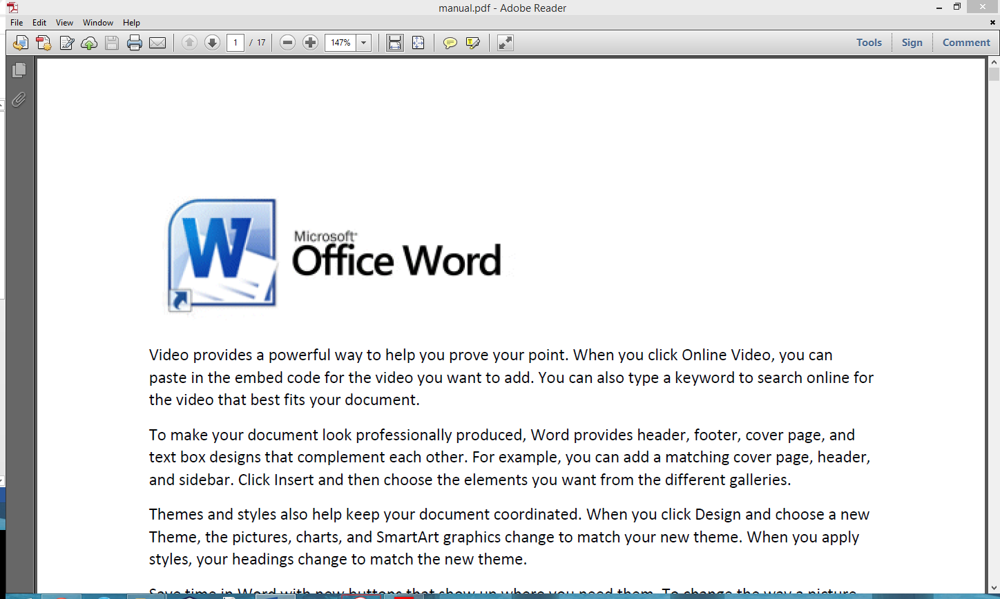

### CTF Writeup: CSAW 1

In CSAW 1, you are provided with a [manual.pdf](manual) (a pdf file) and are told to find a password. So, the first thing to do is try to open it.

Now that we have established that it is able to be opened, we are looking for a password. The first thing to try, instead of reading the entire manual (you are under a time constraint), is to use the ctrl+f command and search for password.

So, there is hidden data there. Let’s try copy pasting the line and see what we get.

 Password: MAwj!LmFHLjF
Well, there is the password.
