# Overflow 1

### Follow Along

We will be traversing dangerous roads in the next two lessons. Please download [binary.7z](binary.7z) and follow along.

### The Binary

First of all, binary is composed of 1s and 0s (obviously). Why so much binary you ask? The CPU of a computer is made up from millions of transistors. Each transistor is a logic gate that only has two states: on and off. Therefore, everything ends up being binary. A 0 in binary corresponds to the off state and a 1 corresponds to the on state. The most basic form data in computing terms is the bit. A bit is a 1 or a 0. 8 bits make up a byte. A byte can be represented as two hexadecimal digits or a integer from 0 - 255. Now on to binary files. Binary files are not text files. They can contain any kind of information. However, the type of binary file we are going to focus on is an executable Linux binary.

### Introduction to Executing Executables

An executable is a binary file that stores instructions which are sent to the CPU. When you run a program, it is first loaded into the memory. The CPU will fetch instructions from the memory, decode the instructions, execute the instructions, and write the output back to the memory. We will not discuss in detail how this works (at least not in this lesson). Instead, we will simply say that when we pass an instruction to the processor, we expect an execution and output.

### A Simple Program

```c
/*Example 1*/
#include <stdio.h>
#include <string.h>
int main()
{
	int a = 1;
	int b = 2;
	int c = 3;
	printf("%d\n", a);
	printf("%d\n", b);
	printf("%d\n", c);
}
```

We must first understand what this program does. It is coded in C, plain C, not C++ or C#. All this program does is set three variables equal to then integers 1 - 3 and then print them out each on it's own line. For the purpose of this lesson, I am running a 32-bit version of Kali Linux in Vmware. I have disabled Address Space Layout Randomization (ASLR). ASLR basically randomizes and rearranges everything, which would make everything much more complicated. We will discuss this in later lessons. Everything that is being compiled also has stack protection disabled because we want to exploit and mess with the stack.

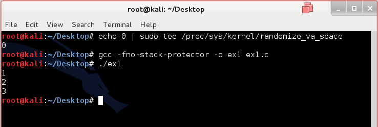

The program works as described.

### Looking Under the Hood

We have seen the C code, but what we are running is no longer C code. Instead, it is binary code. However, looking at a bunch of 1s and 0s won't help us understand what is going on (unless you're a CPU). We need a more effective way of seeing what is going on beneath the hood of the application. To do this, we need assembly code. Assembly code or assembly language is a low-level programming language. Assembly code is not portable across machines with different CPU architectures as each architecture has different assembly code. We will be working with Intel's x86 processor architecture (more specifically i386 for this virtual machine) for this lesson. You might wonder what assembly code looks like or how we are going to analyze the executable. I'll show you. The box denotes where the assembly code of the main function is.

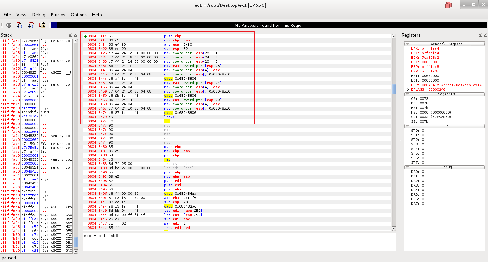

Not bad enough you say? Let's try GDB. It's more powerful but it's all text based.

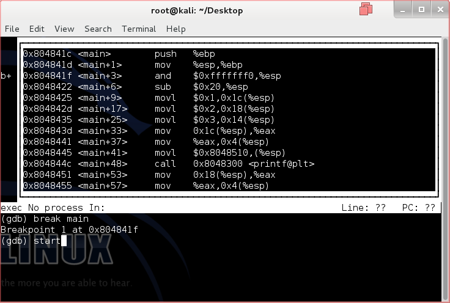

EDB is better for understanding the basics. Follow along while I explain every single instruction.

Download [Debug.7z](Debug.7z) before continuing.

### Registers

To better understand the assembly instructions, we need to understand another component of the processor. Please open up image 001.png found in Debug.zip. Note that the registers section is located in the upper right. The RAM of a computer might be much faster than the hard drive at storing and obtaining information, but it is still not fast enough for the processors to manipulate all of the data. To solve this problem, digital processors are built with process registers (or simply registers) that store a small amount of information that can be quickly accessed, tested, and manipulated. 32-bit x86 processors have 8 registers. They all have the prefix E for extended. The EAX, EBX, ECX, and EDX and the commonly used general purpose registers. ESI and EDI are also general purpose registers but they cannot act as 16-bit or 8-bit registers (unlike EAX-EDX, whose last 2 bytes can be used as a 16-bit register). EBP and ESP are general purpose registers but they have specific functions. EBP is the base frame pointer and ESP is the stack frame pointer. We will go over what they do in another section.

|Name|Appearance (32-bit)|Type|
|:---:|:---:|:---:|
|EAX     |00000000|     General Purpose Register |
|EBX     |00000000|     General Purpose Register |
|ECX     |00000000|     General Purpose Register |
|EDX     |00000000|     General Purpose Register |
|EBP     |00000000|     Base Pointer Register    |
|ESP     |00000000|     Stack Pointer Register   |
|ESI     |00000000|     General Purpose Register |
|EDI     |00000000|     General Purpose Register |

You might have noticed that each register has 8 "characters." Registers are expressed in hexadecimal notation. Each hexadecimal digit is 4 bits long. Since the registers are 32-bit, there should be 32/4 or 8 hexadecimal characters.

# Stack

If you look on the left hand side of 001.png, you'll notice a section called stack. What is the stack? It's basically the memory. While a processor has registers, it still needs the memory since its registers can only store a tiny amount of information. A stack is contiguous and used by functions to store information. Here is the interesting thing about stacks: the top of the stack is closer to the bottom of the memory. Look at the memory address locations in 001.png. Notice how the top of the stack has lower memory addresses than the bottom. Like a stack of anything, it grows "upwards" (towards lower memory addresses). When data is added, it goes to the top of the stack. Computers follow the Last In First Out (LIFO) queueing theory. The last thing piled on top of the stack is the first thing taken off.

```
Lower Memory Address

          <-   New data goes here
|00000000|     Top of stack
|00000000|
|00000000|     Bottom of stack

Higher Memory Address
```

You're probably wondering how this is accomplished. If something is added to the top of the stack, how does the processor manage this data? Is the rest of the stack pushed down? These questioned can be answered when we learn about the purpose and function of the two special registers EBP and ESP.

### EBP and ESP

The aforementioned special registers are crucial when it comes to memory. EBP's function changes depending on the code. If the executable is not optimized (or the asm code was written by a human), EBP will keep track of the where the stack is at the beginning of a function. Since EBP never changes throughout a function, it can be used as a reference for variables and data stored in the stack. ESP on the other hand, is a highly dynamic register that points to the top of the stack (which again is at a lower memory address). Here is where we answer the question of how new things are added to the stack. If something is added to the stack (which can be accomplished using "PUSH" instruction), the ESP moves back 4 bytes. To allocate space for variables, all the CPU needs to do is tell the ESP register to move back a certain number of bytes rather than shifting everything down. Why? Because registers are much faster and easer to manipulate than RAM.

### Assembly Code

When we debug or analyze compiled C applications, we end up with assembly code. There are two syntaxes for assembly language: Intel and AT&T. We will be focusing on the Intel syntax. The direction of operand for the Intel Syntax is destination, source.

```
instruction    destination, source
-----------------------------------
Example:
mov    eax, 0x60
(moves 0x60 into eax)
```

Then we come to the world of assembly instructions. Contrary to what you might believe, there are actually not too many of them. However, we will only list a few important ones that we will be using here.

* **push [operand]** - the push stack instruction decrements ESP by 4 and moves the operand to the top of the stack.
* **pop [operand]** - the pop stack instruction moves the 4 bytes at the top of the stack into the operand and increments ESP by 4.
* **mov [destination], [source]** - the move instruction copies data from the source into the destination. Memory-memory moves are not possible.
* **and [destination], [operand]** - the bitwise and instruction performs a bitwise AND operation on the operand and destination but stores the data in the destination.
* **sub [destination], [operand]** - the integer subtraction instruction subtracts operand from destination and stores the result in the destination.
* **call [operand]** - the subroutine call instruction calls a subroutine (another function). It will jump to the operand location. It saves the location to return to when the subroutine completes.
* **ret** - the subroutine return instruction retrieves the original location before the subroutine was called from the stack using 'pop' and jumps back to that location.
* **leave** - the leave stack frame instruction is a processor specific instruction telling the processor to release the stack storage. This is usually called at program completion.

### Analyzing ex1

Now that I have tortured you with painful information, let's analyze ex1. Note: While the image numbers correspond to the line numbers, register and stack changes will take effect in the NEXT image. Please keep that in mind when I refer to stack and register changes.

```
push ebp
mov ebp, esp
and esp, 0xf0
sub esp, 32
mov dword ptr [esp+28], 1
mov dword ptr [esp+24], 2
mov dword ptr [esp+20], 3
mov eax, dword ptr [esp+28]
mov dword ptr [esp+4], eax
move dword ptr [esp], 0x08048510
call 0x08048300
mov eax, dword ptr [esp+24]
mov dword ptr [esp+4], eax
mov dword ptr [esp], 0x08048510
call 0x08048300
mov eax, dword ptr [esp+20]
mov dword ptr [esp+4], eax
move dword ptr [esp], 0x08048510
call 0x08048300
leave
ret
```

**Line 1:** Save the old EBP value. This always happens at the start of a function. Previous EBP values are useful for debuggers even in optimized binaries. You'll notice in 002.png that ESP was decremented by 4 to make room for the EBP value (bffffab8) that was added to the top of the stack.

**Line 2:** Set a new EBP value by copying the ESP value into EBP. This always happens at the start of a function. The new base stack value is bffffa38. Notice how that memory address also contains the old EBP value.

L**ine 3:** This is a special version of memory allocation optimized by the compiler. It allocates 8 bytes and performs the same task ( the program would run the exact same) if replaced with sub esp, 8. Notice in 004.png that ESP was decremented by 4.

**Line 4: **This is the common way of allocating memory at the start of the function. It always happens at the start of a function. ESP is decremented by 20. Why 20? Because 32 is represented in decimal while memory is in hex. 32 is actually 20 in hex. This line allocates 32 additional bytes for the function for a total of 40 bytes including line 3. Remember, memory is expressed in hex. To find the number of bytes allocated, use the following:

$$bytes = (higher\hspace{0.2cm}memory\hspace{0.2cm}address)_{10} - (ESP)_{10}$$

Convert both the higher memory address and ESP values into base 10 and then perform subtraction to find the number of bytes allocated (if not given sub value).

**Line 5:** Copy 1 into the memory address of bffffa2c. Notice that locations in the memory are reference against the ESP. Again, 28 is the decimal representation. Therefore, the actually addition would be [ESP+1c]. DWORD PTR stands for the size of the directive. DWORD means 32-bits, WORD means 16-bit, and BYTE means the single byte. It is a good time to mention that the WORD size of Intel's x86 is 4 bytes. This is not always the same for all processors. Ultimately, this instruction copies the 32-bit representation of the decimal number 1 into the memory address of bffff2c.

**Lines 6-7:** Similar to line 5, the numbers 2 and 3 are copied into the memory. Notice that things are stacked on top of each other. The stack grows up but it is actually growing towards lower memory addresses.

**Lines 8-10:** Prepare data for the function printf. Line 8 copies the "1" moved into the memory by line 5 into the EAX register for quick manipulation. Lines 9 and 10 moves more data into the memory for printf.

**Line 11:** Call the printf function. The function does a whole bunch of things to prepare the data before printing it out. We will not go over in detail how that is done. However, do know that it will eventually return to the original location and return EBP and ESP registers to their original values.

**Lines 12-19:** Use the same method on the integers 2 and 3.

**Line 20:** Leave the function by resetting the EBP and ESP to what they were at the beginning of the function (image 001.png).

**Line 21: **Return of main function. Exits application.

### Introduction to Overflow

"Wow. All of this before the actual lesson" is probably what you are saying right now. However, I assure you that with your understanding of assembly, stacks, and registers, you will understand this section much more easily. What is buffer overflow exactly? As you may have already noticed, C applications allocate memory at the start of the function. Similarly, inputs need to specify the amount of memory it needs. Let's look at a sample program.

```c
/*Example 2*/
#include <stdio.h>
#include <stdlib.h>
#include <string.h>
int main(int argc, char *argv[])
{
	if(argc != 2) //If no argument was given, exit.
	{
		exit(0);
	}

	char pass[16]; //Give the character array 'pass' a buffer of 16 bytes.
	int auth = 0; //Set the integer auth to 0.

	strcpy(pass, argv[1]); //Vulnerable. Copies the input argument into pass. *Strcpy does not check for memory bounds.

	if(strcmp(pass, "passkey") == 0) //If pass is equal to "passkey", set auth to 1.
	{
		auth = 1;
	}
	else
	{
		printf("Wrong Password.\n"); //Vulnerable. Prints "Wrong Password." *Application does not exit.
	}

	if(auth == 1) //If auth is 1, give the secret.
	{
		printf("Secret!\n");
	}

	return 0;
}
```

Seems like a pretty realistic program right? (I know it's not just go along with it.) The program takes in an argument, the password. If the password is correct, it will give you the secret. Otherwise, it will display "Wrong Password." If you didn't pass it an argument, it will exit.

You may have noticed the locations where the code is commented to be vulnerable. Why is it vulnerable you ask? Functions such as gets(), memcpy, strcpy(), sprintf(), etc. all manipulate the memory. However, they do not check buffer boundaries. What does this mean? In ex2, pass character array was given a buffer of 16 bytes. However, strcpy could care less whether we gave pass a buffer of 1 byte of 100 bytes. It will happily overwrite things in the memory if the size of the data being copied exceeds the buffer size. What is the issue of not doing bound checking? The following could happen:

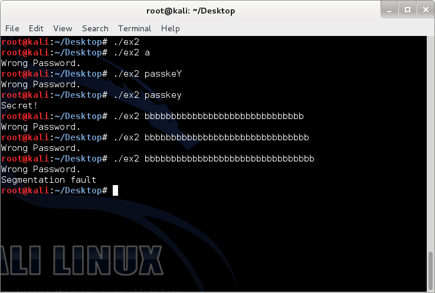

A segmentation fault is the result of a memory access violation. What has happened is that we only gave 16 bytes to pass but we ended up putting 32 bytes into pass. The 32 Bs overwrote the return address so when the program got to that location, it could no longer proceed because something completely different is located at the memory address composed of all Bs and the program could not access it. This is actually really important but we will not discuss further at this point. A segmentation fault is especially dangerous for web services as it causes programs to crash. I will not plague with more assembly learning here. We will go over these instructions in overflow 2 or somewhere else. However, we do need to look at a few important things.

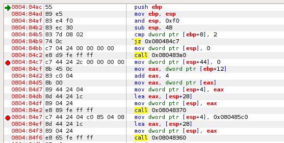

Notice how the compiler included the additional pass[16] buffer at the top of the function. The total amount allocated was 28 last time, remember? Now it's 38. Now that buffers work in chunks. Increasing the buffer size by 2 will not necessarily increase the total ESP sub by 2. Instead, this is determined by the compiler. No additional ESP changes will occur as a result of memory buffering (it is much faster this way). The first breakpoint (red circle) is set at 0804:84c7. At that location, we are setting auth to 0. The section after that is preparing things for strcpy. Call 0x8048370 is the strcpy function. I've set a breakpoint after so we can view the memory results after strcpy finishes its task.

### Analysis of ex2's Stack

You may not think that causing programs to crash is much fun at all. However, we can do something more fun with overflow. Let's look at stack when we pass the program different arguments.

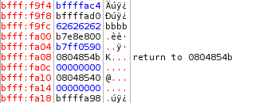

bfff:fa0c is the address of auth. It is lower in the stack because it was set right before strcpy was called. As of right now, auth is 0. bfff:f9fc to bfff:fa08 is the allocated character array 'pass'. Notice that only four bytes are being used.

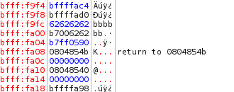

The addresses are the same. However, you may have noticed something interesting. strcpy starts at the top of the buffered stack and writes data DOWNWARD towards the bottom of the stack. Therefore, these functions write from lower memory addresses to higher memory addresses, exactly opposite of how stacks work. Let's test with more bs.

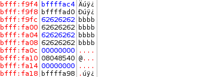

Predictable results. This is technically the maximum amount of data that was allocated. However, we know we can bypass the memory allocation with strcpy. We shall add an additional b.

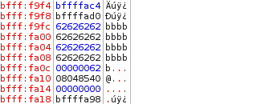

Very interesting results. The last b overwrote the end of bfff:fa0c. Now, bfff:fa0c is 96 (62 in base 16 is 98 in base 10). Wait. That means we can manipulate auth to whatever we want by simply filling up the pass buffer with 16 bytes of anything and then sending a 17th byte equal to an integer. I believe what we want to do here is to set auth to 1

### The Final Overflow

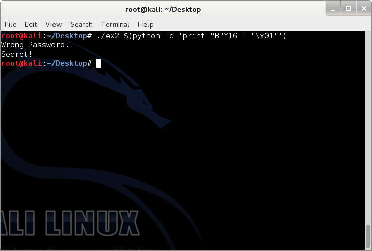

The command that was executed was:

```bash
./ex2 $(python -c 'print "B"*16 + "\x01"')
```

What this command does is that it will pass to ex2 the output from Python printing out 16 Bs along with a byte of binary. This is binary is actually hexadecimal byte with an integer value equivalent of 1. The program will strcpy the string, overwriting the ending 00 of the 4 bytes at bfff:fa0c with 01. When the program reads the value for auth, it will now read as a 1 instead of a 0. Even though we didn't provide the correct password, we still got the secret. What a nifty trick to know hm?

### Simple Prevention Methods

Although we've only discussed strcpy, a prevention to protect the program would be as easy as exiting if the password was wrong. Otherwise, we could implement a buffer size check system.

```c
/*Example 2 (secure)*/
#include <stdio.h>
#include <stdlib.h>
#include <string.h>
int main(int argc, char *argv[])
{
	if(argc != 2) //If no argument was given, exit.
	{
		exit(0);
	}

	char pass[16]; //Give the character array 'pass' a buffer of 16 bytes.
	int auth = 0; //Set the integer auth to 0.

	if(strlen(argv[1]) <= 16) //Improved.
	{
		strcpy(pass, argv[1]);
	}

	if(strcmp(pass, "passkey") == 0) //If pass is equal to "passkey", set auth to 1.
	{
		auth = 1;
	}
	else
	{
		printf("Wrong Password.\n");
		exit(0); //Improved.
	}

	if(auth == 1) //If auth is 1, give the secret.
	{
		printf("Secret!\n");
	}

	return 0;
}
```

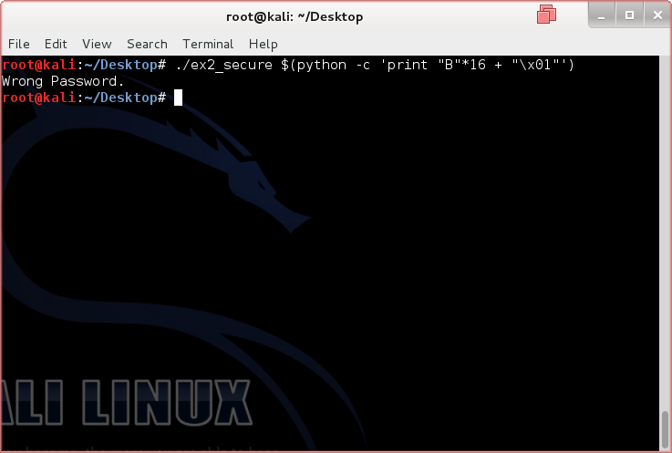

### Further Readings and References

"x86 Assembly Guide" - http://www.cs.virginia.edu/~evans/cs216/guides/x86.html

"Stack based buffer overflow - tutorial" - http://www.exploit-db.com/wp-content/themes/exploit/docs/28475.pdf

"Common vulnerabilities guide" - https://security.web.cern.ch/security/recommendations/en/codetools/c.shtml

Tool: Kali Linux - http://www.kali.org/downloads/
