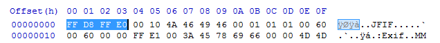
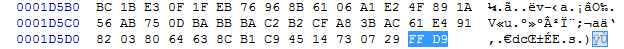
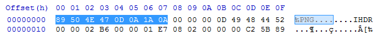
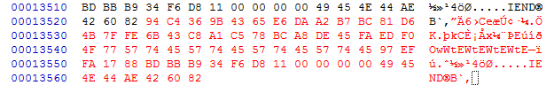

# File Carving 1

### Intro to File Carving

File carving is the process of searching for files on the basis of binary content rather than metadata. You should read the lesson on File Structures before continuing. As we know, file are composed of binary data. The only way a computer knows where each file is and how big a file is is through the use of metadata. Metadata, like those stored by the Windows Master File Table (MFT) tells exactly where a file is, how large a file is, when the file was last modified, and other related information. File carving is necessary when metadata is not available to the investigator or that the metadata is corrupt

### The Three Methods of Carving

There are three main ways that file carvers operate.

#### 1. Header -> Trailer or Header -> Size search.

A common way to crave files is to search for headers and carve to the trailers. This is present in JPGs and other file formats with identifiable headers and trailers.




A file carver will simply scan for the hex signature FF D8 FF (E0) and then carve to FF D9. In the example below, the file carver will only scan from the header of the PNG to the EOF. It will ignore any data following the EOF.




However, some files don't have set trailers. In the case of BMPs (which have headers and no trailers), a file carver may simply choose to estimate a maximum file size or to complete a check to see if an image is completely carved based on size information.

#### 2. Structure based carving.

This method is more applicable to files that do not have a trailer. File carvers will often read the header and attempt to use information following the header to determine how large a file is or when to stop carving.

#### 3. Content based carving.

This is one of the more advanced methods of carving employed by file carvers. This will use content structure like html tags, language recognition, chi-squared analysis, and information entropy to determine the start and end of a file.
Using File Carvers

There are many file carvers available for use. Some of them are made specifically for images. The two carvers that have proved to be especially useful are Scalpel and Foremost. They are very easy to install on Linux but require compiling on Windows. Being a nice person, I compiled them for you and even included a larger and more comprehensive signature list. You can download them here - [carvers.7z](carvers.7z).

Using file carvers is very easy. The common commands are shown below. Also, you can run cmd.bat in the respective folders to spawn CMD in the current directory.

```
Scalpel Help:
	scalpel -h
Scalpel Basic Carve:
	scalpel -i input.image

Foremost Help:
	foremost -h
Foremost Basic Carve:
	foremost -t all -i input.image
```

### Further Readings and References

"File Carving" - http://www.forensicswiki.org/wiki/File_Carving

Tool: Scalpel 2.0 - https://github.com/machn1k/Scalpel-2.0

Tool: Foremost - http://foremost.sourceforge.net/
