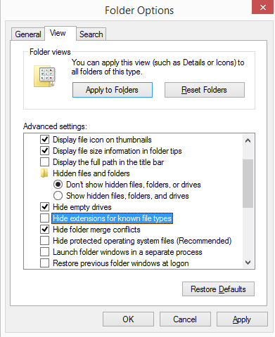
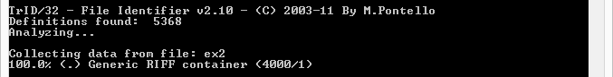
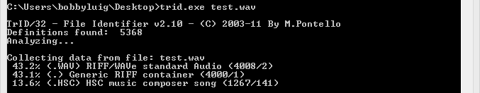
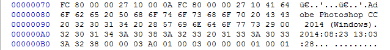

# File Structure

### File Basics

Have you ever wondered what exactly makes up a file on your computer? How does the computer distinguish between one file type and another file type? Most operating systems (even Macs) use a file extension to distinguish between files. I really hope you know what a file extension is but just in case, it's the last part of the file name after the dot. I'll even show you an example.


As you can see, .txt is the file extension. Currently, my computer recognizes a .txt file as a Text Document. This can of course be modified. Windows has a tendency to hide file extensions by default. You can enable it using Folder Options.



### File - Program Interaction

When you want to view a file on a computer, the OS will direct a preassigned program to read the data from the file. Changing the file extension will only change the program used to open the file and not the file itself. I had to add this in here in case you didn't know. but I really hope you knew this already.

### The Magic Number

Like it or not, file extensions are not absolute or conclusive when it comes to defining a file type. I could easily change the file name and the extension to whatever I want. I could even remove the extension. Then what are you going to do? You could cry (which is what 50% of computer users would do in this case), or you could continue reading and learn the more conclusive way of defining a file type.

Everything on your computer is stored in binary on the HDD. We will not discuss binary too much in this introductory lesson to prevent you from running away in fear. Even though everything is in binary, we need a more condensed method of representing 1s and 0s. In computer science, we frequently use hexadecimal characters to represent raw data. Two hexadecimal characters make up a byte and one byte is 8 bits. A bit is a 1 or a 0. Let's view the hexadecimal data of an image file using HxD (a hex editor).

|Image|Hex|
|:---:|:-:|
||")


Notice the 3 bytes at the start of the JPG file. Every single JPG file, whether created by Photoshop or a Digital Camera, will have the same 3 bytes at the start of a file. We call this the "magic number" of file header signature. Different file types have different headers. A comprehensive list can be found on the [File Signatures Table](http://www.garykessler.net/library/file_sigs.html).

### Footers

Files that have headers often contain footers as well. A footer usually indicates the end of a file. In JPG images, the footer (or End of Image) is defined by the bytes FF D9. No image data will be present after those bytes. Remember that not all files have footers. In addition, some encrypted files may not have identifiable headers or footers at all.

")

### Binary Signature Analysis

We know that we can make people cry when we remove the file extensions. However, we need to learn how to not cry when we are given files with incorrect extensions or no extensions. One monotonous method of doing this would be to open up the file in HxD and looking for the proper header signature in the File Signatures Table. Another faster and more precise way of doing this is using a tool called TrID. You can download the tool in the "Further Readings and References" section. TrID is a binary signature analyzer. When we change the extension of a file, we are not modifying its binary contents. TrID is powerful and comprehensive. It even has the ability to learn and recognize new file formats. To use TrID, you will need to download the Linux or Windows version as well as the TrIDDefs package (which contains definitions for over 5000 common file types). Place both trid.exe and triddefs.trd in the same directory. Use CMD or the Linux Terminal to access TrID. The basic usage in Windows is:

```
trid.exe [filename]
```

Let's analyze ex1.jpg using TrID.


Generally, the file type and extension with the highest percentage of composition is correct. However, there may be false positives for certain extensions as some file types are quite similar.

### Advantages and Disadvantages of Binary Analysis

Aside from the obvious advantage of time saving and efficiency, binary signature analysis also surpasses manual analysis in terms of precision. Binary signature analyzers like TrID can produce consistent results every time with absolutely no error (unlike a human). However, binary analysis is not always accurate. TrID does not take into account the entirety of the file. It tends to put a greater emphasis on file headers. However, file headers and footers can be very deceptive. Manual analysis of tampered files tends to be much more accurate when compared with the same TrID analysis.

### File Tampering

Speaking of tampering with files, let's tamper with the image file. I've modified the header of ex1.jpg and renamed it [ex2](ext2). As you can see in the image below, I've altered the first 4 bytes to correspond to a WAV file (Windows audio file).

")

Here is what TrID has to say about the file.



Clearly, TrID failed at detecting the proper file type. The term generic implies that while a header was found, the content and/or data after the header was not a specific match to any know file type. This should be very suspicious to the analyzer because most files should have a slight similarity to other file types. An example of a TrID analysis on an actual wav file is shown below.



When TrID or heuristics fail, it is necessary for manual analysis. In the case of ex2, the existence of Exif data pointing to "Photoshop" gives away the true nature of the file.



### Further Readings and References

"File Signatures Table" - http://www.garykessler.net/library/file_sigs.html

Tool: TrID - http://mark0.net/soft-trid-e.html

Tool: HxD - http://mh-nexus.de/en/hxd/
