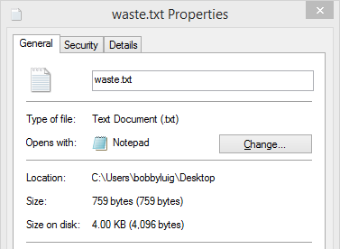
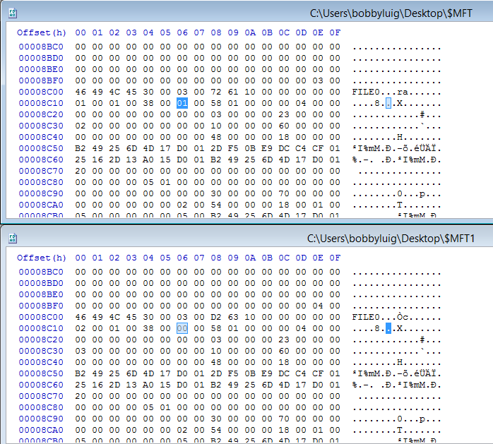
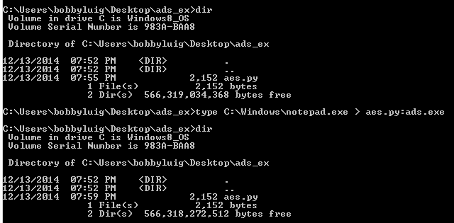
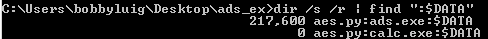
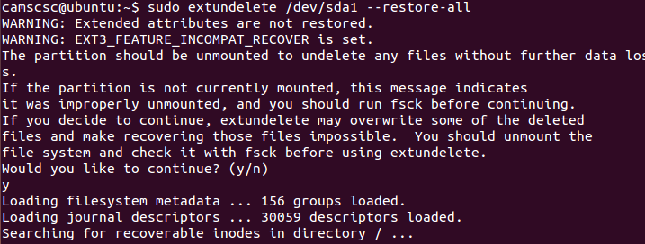

# File System 1

### What is a File System?

We know that files have a header and a footer. If you do not know that, the please read File Structure before continuing. However, computers need an organized and efficient way to store and access files. Putting files together in a storage area without properly organizing them is about as pointless as having a library where all of the books had blank covers and were scattered in no particular order all over the floor. The lack of an identifying feature or location for the files would make storage and access nearly impossible. Different file systems were created to store, organize, and manage information on a hard drive. Before we go on to talk about analyzing individual file systems, we first need to understand some basics that all file systems generally have in common.

### Common Aspects of File Systems

* File names - Most file systems have a way to store file names. Usually, the file system also restricts the length and character set of the file names. In select file systems, file names are not case sensitive.
* Directories - Folders allow for organization of data into groups. Most modern and high end file systems allow subdirectories with a hierarchy structure. Windows uses indexes on file names to indicate the hierarchy position while Unix/Linux uses an inode.
* Allocation Unit - For efficiency purposes, most file systems do not process each byte on the hard drive separately. Instead, during formatting, the file system separates the entire drive into clusters (512 bytes to 64 kB). Clusters smaller than 512 bytes are too inefficient to manage. However, larger clusters often translates to more wasted space.
* Metadata - Other information about the file, such as user permissions or file attributes, are stored in the metadata. Some attributes are specifically associated with one file system.

### NTFS

NTFS, or New Technology File System, is a file system created by Microsoft. If you are running Windows, your main partition is most likely NTFS. NTFS uses the aforementioned allocation units or clusters. A common example of slack space or unused space is shown below. It should be evident that my file system is using 4kB clusters.

As you can see, the file is only 759 bytes. However, it takes up 4096 bytes. That's over 80% of unused space. If there were 100 of the same files, each would take up the same 4kB chunk and waste 80%. However, utilizing chunks makes the file system much much faster.

NTFS stores file and folder information in something called a Master File Table (MFT). There is at least one MFT entry for every file or folder on the drive. Basic information such as name, size, time/date stamps, and data content are stored in the MFT. NTFS reserves a contiguous space (usually at the beginning of the HDD) for the MFT. Without the file table, you would just have a bunch of random data.

### NTFS File-Recovery

Sometimes, laziness causes one to shift-delete things rather than sending them to the recycle bin. No need for tear drops quite yet. Like most file systems, files are not actually deleted when they are removed from the recycle bin. Likewise, deleted files from removable drives are not truly removed upon deletion.

As shown in the image above, 1 byte of difference in the MFT from 01 to 00 will mark the file for deletion. However, the file is still detectable by scanning the MFT and recoverable with its original metadata. Using recovery tools like TestDisk and OSForensics, deleted files from NTFS partitions can be accurately recovered using MFT information rather than file carving.

### Alternate Data Stream

NTFS partitions contain a special "feature" known as the Alternate Data Stream (ADS). ADS was originally implemented for fork support. However, most programs, including Windows Explorer, will kindly ignore any ADS. The data in an alternate stream is specified by a ":" following the original file name of the "cover file." ADS impregnated files show no difference in their metadata.

One way to view ADS is to enter the file name followed by a colon. Another way is to scan and extract using tools like Nirsoft's AlternateStreamView.

### Extended File System

ext2, ext3, and ext4 and versions of the Extended File System commonly used by Linux. Similar to NTFS, Linux has data which represents a system objects and its metadata. The data is known as the index node or inode. When files are deleted in a Linux system, the entry regarding the file is deleted and the system marks the area containing the file and its inode as free space. Again, neither the file nor its inode is actually removed. A common tool used to recover deleted files in Linux is extundelete.

### Further Readings and References

"Alternate Data Streams in NTFS" - http://blogs.technet.com/b/askcore/archive/2013/03/24/alternate-data-streams-in-ntfs.aspx

"Linux File Systems: Ext2 vs Ext3 vs Ext4" - http://www.thegeekstuff.com/2011/05/ext2-ext3-ext4/

"Overview of FAT, HPFS, and NTFS File Systems" - http://support.microsoft.com/kb/100108

Tool: ADS Viewer - http://www.nirsoft.net/utils/alternate_data_streams.html

Tool: extundelete - http://extundelete.sourceforge.net/

Tool: Test Disk - http://www.cgsecurity.org/wiki/TestDisk

Tool: OSForensics - http://www.osforensics.com/
