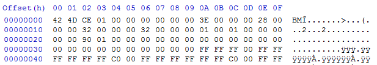
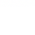
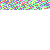
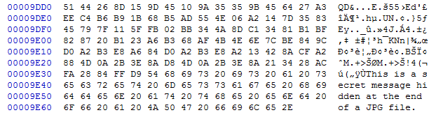

# Steganography 1


### What is Steganography?

What exactly is steganography? Steganography is the art of concealing information. Unlike cryptography, steganography does not stand out. Take a look at the two images above. The first one is the original image but the second one contains the hidden message **'Do you notice the subtle difference?'** The difference is definitely not noticeable by the human eye. Now let's look at an encrypted version of the same message.

```
Gcwco acmqei moi kocmwi gqkkiiiaei?
```

The message above was encoded using Vigenére Autokey and the message itself as a password. Notice how blatantly it begs to be solved.

### Image Steganography

In steganography 1, we will be focusing on image steganography. Before we even get to how the information is hidden, we need to understand how the message carriers (the images) function. There are four main types of images: JPEG, GIF, BMP, and PNG.

**JPEG** (extension .jpg) uses lossy compression methods to make the image size smaller. It is the most common format for photos and pictures. JPEG supports 8-bit grayscale to 24-bit color images. The quality of JPEGs slowly decrease the more times you edit it and save it.

**GIF** (extension .gif) is limited to 8-bit (256 colors). But hey, it supports animation.

**BMP** (extension .bmp) is Microsoft Window's graphic file format. BMPs are not compressed.

**PNG** (extension .png) is the alternative to GIF. It supports 8-bit (with optional transparency), 24-bit, or even 48-bit (which becomes 64-bit with the alpha channel). PNGs are widely used due to it's transparency capability.

### Bits and Bytes

You're probably frustrating over this concept of a "bit" right now if you've never studied image color depth. Let's start with the basics. First of all, what is a bit? A bit is the most basic unit of information in computing. It can either be a 0 or a 1. A byte on the other hand, is a group of bits (usually 8). Most image formats apply compression and peculiar storage formats. We cannot determine pixel values just by looking at a hex editor :p. If you look at the image below, would you be able to tell that it is a blank 100x100 bmp without spending a lot of time manually decoding it? Probably not.



Have you ever looked at a hex editor before? You may have noticed how hex values are grouped in pairs. The reason for this is our human defined definition of a byte.

$$(AA)_{16} = (170)_{10} = (10101010)_{2}$$

Similarly in Python as:
```
0xAA = 170 = 0b10101010
```

0xAA (where 0x defines the start of a hexadecimal number in python) is equivalent to the number 170 (in base 10) which is also equivalent to 0b10101010 (where 0b defines the start of a binary). If you are not familiar with hexadecimal or binary, please study them before proceeding.

Do you notice that the binary contains contains 8 bits? Gasp. It appears that a byte, the basic unit of grouping, is described by a two digit hexadecimal number or an 8 bit binary.

### Color Depth

The aforementioned 8-bit, 24-bit, and 48-bit refer to the color depth of the image. In the previous subsection, we took a look at the byte. Notice that color depth only go as low as 8-bit (or 1 byte). Now is the time to pull out some of those artistic knowledge that I know most of you who actually read this do not have. Most image formats store colors in an additive format, making the primary colors red, green, and blue. From now on, they will be referred to as R, G, and B. This is different from the subtractive combination of colors that printers often use (cyan, magenta, and yellow). You may have seen from paint of other photo editing tools that these R, G, and B values range only from 0 - 255. That is because most normal color depth images only use 1 byte to store a color.

```
Minimum value: 0x00 = 0b00000000 = 0
Maximum value: 0xFF = 0b11111111 = 255
```

For 8-bit images, that one byte has to store all three values (thus the horrific 256 colors). 24-bit JPGs use one byte for each R, G, and B color value. I hope you have now made the connection that it's called 24-bit because 3*8 = 24. PNGs and other transparency capable formats are slightly different. They can have an addition alpha channel (A) that defines the opacity of the pixel. R, G, B, and A makes a PNG 32-bit. Finally, we have the ultra high 48-bit and 64-bit color depths. Those contain millions of colors because each R, G, B, and A value take up 2 bytes (16 bits) rather than 1 byte. This is detailed below.

```
8-bit:
(R + G + B) = 8 bits
R = 3 bits
G = 3 bits
B = 2 bits
Transparency extra.
Total of 256 colors.

16-bit:
(R + G + B + A) = 16 bits
Each 4 bits.
Transparency optional.
Total of 4096 colors and 16 levels of transparency.

24-bit:
(R + G + B) = 24 bits
Each 8 bits.
No transparency.
Total of 16777216 colors.

32-bit:
(R + G + B + A) = 32 bits
Each 8 bits.
Transparency optional.
Total of 16777216 colors and 256 levels of transparency.

48-bit:
(R + G + B) = 48 bits
Each 16 bits.
No transparency.
Total of 4096^3 colors.

64-bit:
(R + G + B + A) = 64 bits
Each 16 bits.
Transparency optional.
Total of 4096^3 colors and 4096 levels of transparency.
```

Yes. This is pertinent to what we are about to learn and do.

### Least Significant Bit

The least significant bit (LSB) is the most important when it comes to steganography. Why is it called "least significant" then? The LSB is the last or trailing bit in a byte. Changing the LSB would make no significant changes to the image data. Don't believe me? Asking why we don't use the most significant bit (MSB) for steganography? I'll show it to you mathematically and visually.

```python
>>> int('0b11111111', 2) - int('0b11111110', 2)
1 #Difference from changing the LSB
>>> int('0b11111111', 2) - int('0b01111111', 2)
128 #Difference from changing the MSB
```
|Original|LSB|MSB|
|:----:||:-----:|:-----:|
||||

The Python up there shows that changing the LSB will only modify a pixel's R, G, or B value by 1 while an MSB change will modify it by over 100. If mathematics didn't do it, I'm sure the visual did. When we want to hide data, all we need to is convert it into binary and replace the LSB of each R, G, B, (or A) with a bit of the data. We will discuss this more later. Notice that if steganography used MSB or something that's not LSB, the difference will be much more noticeable. The message hidden was: 'Do you notice the difference? Yeah. I think you notice the difference now. Why? Because I told you that LSB is the least significant and will not cause a lot of change to the image.

### Not Unlimited

Remember when I said that color depth is pertinent to steganography? I am about to explain why. Before you hide data in something, you'll probably want to make sure that it can actually store everything and not run out of storage space :p. This is where color depth comes in. Each pixel in an 8-bit image contains 8 bits (if you haven't figured that out yet). Each 8 bits or byte can store one bit of information using LSB. That means a 24-bit JPG has the capacity to store 3 bits of information per pixel. The maximum storage capacity of a carrier can be defined as:

$$capacity = width \times height \times \dfrac{bitdepth}{8} $$

### Putting It Together

We can put all that we've learned into play to actually perform steganography. There are many steganography tools available. Some of those tools do not utilize LSB to hide information. No, they don't use MSB. They use other more complex algorithms. We will take a look at the text steganography portion of a Python stegnography module called Stéganô. I've rewritten and combined important parts of the code so I can explain how the they work. Let's look at how we can hide information in images. The code below comes from the file hide.py (a better custom version that fixes a bug is available for download in a later section).

```python
from PIL import Image

def setlsb(component, bit):
	return component & ~1 | int(bit)

def a2bits_list(chars):
	return [bin(ord(x))[2:].rjust(8, '0') for x in chars]

def hide(input_image_file, message):

	img = Image.open(input_image_file)
	encoded = img.copy()
	width, height = img.size
	index = 0

	message = str(len(message)) + ":" + message
	message_bits = "".join(a2bits_list(message))

	npixels = width * height
	if len(message_bits) > npixels * 3:
		raise Exception("""The message you want to hide is too long (%s > %s).""" % (len(message_bits), npixels * 3))

	for row in range(height):
		for col in range(width):

			if index + 3 <= len(message_bits) :

				(r, g, b) = img.getpixel((col, row))

				r = setlsb(r, message_bits[index])
				g = setlsb(g, message_bits[index+1])
				b = setlsb(b, message_bits[index+2])

				encoded.putpixel((col, row), (r, g , b))

			index += 3

	return encoded

if __name__ == "__main__":
	steg = hide('carrier.png', 'The secret message.')
	steg.save('output.png')
```

We can begin analyzing this script line by line.

### Python: Importing PIL

```python
from PIL import Image
```

First we need to import Image from the PIL library. If you don't have it yet, you can get it by running the following in CMD or terminal:

```
pip3 install pillow
```

### Setting the LSB

```python
def setlsb(component, bit):
	return component & ~1 | int(bit)
```

The function takes in an R, G, or B value as **component** and the bit to be hidden as **bit**. The function uses a smart bitwise method to alter the LSB of the component and return it as an integer value. Let's look at how it works. If you forgot bitwise operations, please review that concept.

Component is 201 and the bit we are trying to hide is 1.

```python
>>> component = int(201) #Set component value to 201
>>> bin(component) #Binary of component
'0b11001001'
>>> component & ~1 #Set the last bit to 0
200
>>> component & int('0b11111110', 2) #Another way to set the last bit to 0
200
>>> bin = int(1)
>>> 200 | 1 #Set the LSB to the bin value
201
>>> 200 | (int('0b00000001', 2)) #Another way to do set the LSB data
201

Converting to Binary

def a2bits_list(chars):
	return [bin(ord(x))[2:].rjust(8, '0') for x in chars]
```

The function takes the ASCII value of each character, converts it into an 8 bit binary, and appends it to the list. The return operation is simplified to a one line list comprehension. The function can be rewritten as the following.

```python
def a2bits_list(chars):
	list = [] #Create an empty list
	for x in chars: #Cycle through all characters
		data = bin(ord(x))[2:].rjust(8, '0') #Convert each character to binary, strip the '0b', and fill it up to 8 bits with empty 0s in the front
		list.append(data) #Add the data to the list
	return list #Return the list
```

### Hiding the Data

```python
def hide(input_image_file, message):
```

Line 9: Accepts the input image file name and the message to hide.

```python
img = Image.open(input_image_file)
encoded = img.copy()
width, height = img.size
index = 0
```

Lines 11-14: Open the image and create a copy for output. Get the image size. Set pixel index to 0 (we need to know where we are in the image to know what index of the message binary to hide in the LSB.

```python
message = str(len(message)) + ":" + message
message_bits = "".join(a2bits_list(message))
```

Lines 16-17: Get the length of the message and add it to the beginning of the message. This is done so that for non-text files, the revealer knows when to stop.

```python
npixels = width * height
if len(message_bits) > npixels * 3:
	raise Exception("""The message you want to hide is too long (%s > %s).""" % (len(message_bits), npixels * 3))
```

Lines 19-21: Checks if the max length of the message exceeds the capacity of the carrier.

```python
for row in range(height):
	for col in range(width):

		if index + 3 <= len(message_bits) :

			(r, g, b) = img.getpixel((col, row))

			r = setlsb(r, message_bits[index])
			g = setlsb(g, message_bits[index+1])
			b = setlsb(b, message_bits[index+2])

			encoded.putpixel((col, row), (r, g , b))

		index += 3

return encoded
```

Lines 23-38: For every pixel (it goes range(height) and then range(width) because we want to encode left-right. Think about it.), if the message has not been completely encoded, get the R, G, and B value of the pixel at the location (col, row). Set the LSB values of each R, G, and B to a bit in the message. Put the new pixel values in our encoded file (a copy of the original image). Add 3 to the index counter because we process 3 bits. Notice a problem here. It only goes by sets of 3s, which can cause incomplete data to be encoded. A fix will be shown later. Finally, return the encoded image.

```python
if __name__ == "__main__":
	steg = hide('carrier.png', 'The secret message.')
	steg.save('output.png')
```

Lines 40-42: If the file is not being imported, use the carrier 'carrier.png', hide the message 'The secret message.', and save the output to 'output.png'.

### Bug Fix

The aforementioned issue of "sets of 3s" incomplete data hiding results when one bit of the message is left out at the end. This results from the set of three check. A fixed version is available for download - hide_fix.py. Figure out what has been fixed and why the fix works.

### Retrieving the Data

Now that we have hidden the data, we want a way to get it back. Stéganô also includes a function to do that. I have simplified the source into reveal.py. The reveal function works by working on the image in 8 bit (1 byte) chunks. Therefore, it can recover the hidden messages from images of different color depths and transparency options.

```python
from PIL import Image

def reveal(input_image_file):
	img = Image.open(input_image_file)
	width, height = img.size
	buff, count = 0, 0
	bitab = []
	limit = None
	for row in range(height):
		for col in range(width):

			for color in img.getpixel((col, row)):
				buff += (color&1)<<(7-count)
				count += 1
				if count == 8:
					bitab.append(chr(buff))
					buff, count = 0, 0
					if bitab[-1] == ":" and limit == None:
						try:
							limit = int("".join(bitab[:-1]))
						except:
							pass

			if len(bitab)-len(str(limit))-1 == limit :
				return "".join(bitab)[len(str(limit))+1:]
	return ""

if __name__ == "__main__":
	print(reveal('output.png'))
```

### Hiding in the Alpha Channel

32-bit PNGs also have an 8 bit alpha channel that can be used to hide information. Below is a modified program that hides additional data in the alpha channel. reveal.py can still extract the data without modification. The code below is from rgba_steg.py.

```python
from PIL import Image

def setlsb(component, bit):
	return component & ~1 | int(bit)

def a2bits_list(chars):
	return [bin(ord(x))[2:].rjust(8,"0") for x in chars]

def hide(input_image_file, message):

	img = Image.open(input_image_file)
	img = img.convert("RGBA")
	encoded = img.copy()
	width, height = img.size
	index = 0

	message = str(len(message)) + ":" + message
	message_bits = "".join(a2bits_list(message))

	npixels = width * height
	if len(message_bits) > npixels * 4:
		raise Exception("""The message you want to hide is too long (%s > %s).""" % (len(message_bits), npixels * 4))

	for row in range(height):
		for col in range(width):

			if index + 1 <= len(message_bits):

				(r, g, b, a) = img.getpixel((col, row))

				r = setlsb(r, message_bits[index])

				if index + 2 <= len(message_bits):
					g = setlsb(g, message_bits[index+1])

				if index + 3 <= len(message_bits):
					b = setlsb(b, message_bits[index+2])

				if index + 4 <= len(message_bits):
					a = setlsb(a, message_bits[index+3])

				encoded.putpixel((col, row), (r, g , b, a))

			index += 4

	return encoded

if __name__ == "__main__":
	steg = hide('carrier.png', 'Hidden message.')
	steg.save('output.png')
```

Now, why don't you try to extract the hidden message from the second image of the CAMS CSC logo at the top of the page?

### Hiding Elsewhere

Is the only type of image steganography LSB? No. There are many other types of image steganography as well. Let's see a few.

### EOF Steganography

We can hide data after the footer of some image formats. JPG images read only from header to footer. Thus, we can safely put any data we want after the footer without disrupting the image at all. However, this method is easily detectable when viewing the contents of the file in a text editor or hex editor.

|Original|With EOF Steg|
|:---:|:---:|
|||

Let's look at how easy it is to detect EOF Steganography.



More steganography carriers, algorithms, and methods will be discussed in another lesson.

### Further Readings and References

"Steganography: Hiding Data Within Data" - http://www.garykessler.net/library/steganography.html

Tool: Stéganô - https://bitbucket.org/cedricbonhomme/stegano

Tool: LSB-Steganography - https://github.com/RobinDavid/LSB-Steganography

Tool: HxD - http://mh-nexus.de/en/hxd/
