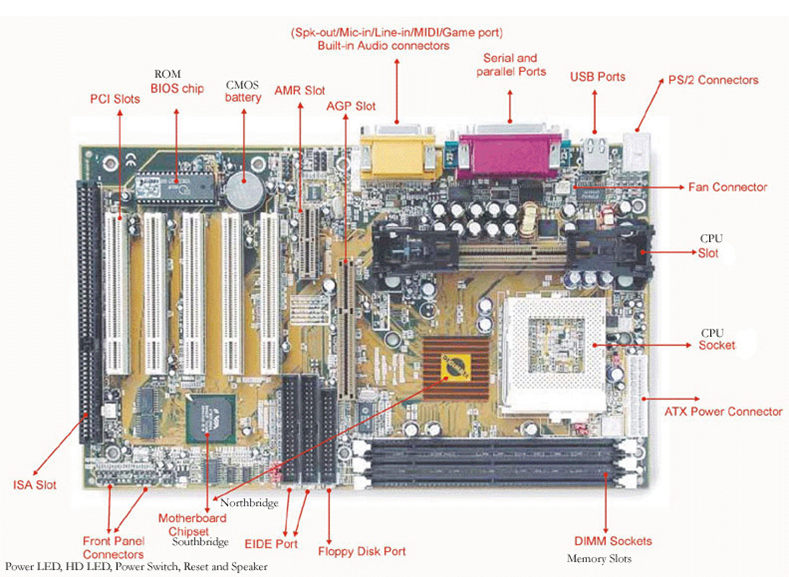

<h1>Computer Hardware</h1>
		
<h3>What is Hardware?</h3>

The physical portion of the computer
 
		
<h3>Examples of Computer Hardware</h3>
<ul>
<li>Motherboard – The “baseplate”</li>
<li>Processor – The "brain"”</li>
<li>RAM – The quick read/write memory of a computer</li>
<li>HDD/SSD – The storage of data</li>
<li>PSU – The power</li>
<li>Case – The house</li>
<li>GFX – The “painter”</li>
</ul>
		
<h3>The Motherboard</h3>
