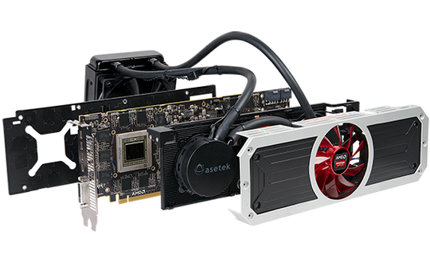

#Computer Hardware
		
### What is Hardware?
The physical portion of the computer

###Examples of Computer Hardware
<ul>
<li>Motherboard – The “baseplate”</li>
<li>Processor – The "brain"”</li>
<li>RAM – The quick read/write memory of a computer</li>
<li>HDD/SSD – The storage of data</li>
<li>PSU – The power</li>
<li>Case – The house</li>
<li>GFX – The “painter”</li>
</ul>
		
### The Motherboard

The motherboard (mobo) is filled with ports that all of the other parts connect to. The motherboard has a chipset which regulates the information between parts. The motherboard contains: 
<ul>
			<li>DIMM Slots for RAM - Has either 2 or 4 for dual channel support</li>
			<li>CPU Socket - Drop the CPU in and secure it with a little lever</li>
			<li>PCI Slots - Slots that are widely used for extra addons such as graphics cards or extra USB 3.0 slots or WiFI adapters</li>
			<li>ATX Power Connector - A socket for power from the PSU to power the motherboard</li>
			<li>"Output Row" - Slew of female adapters that range from DVI, VGA, HDMI, USB, Ethernet, Audio Out/In, or PS/2 connectors</li>
			<li>SATA Slots - Used to connect HDDs and SSDs</li>
</ul>

### The Processor

The central processing unit (CPU) is what computes the 0s and 1s. The clock is the speed in usually GHz or MHz. Most processors are quad-core.

### RAM

RAM is used to quickly store data that is used by a running program. RAM comes in 1GB, 2GB, 4GB, 8GB, 16GB and is clocked from 776 MHz to 2400 MHz.

### Hard disc drive / Solid state drive

HDD/SSD is used to store data on the long term. HDDs use discs to read and write data while SSDs used NAND chips. SSDs have very fast read/write times, but they are more expensive.

### Power Supply Unit

The PSU simply gives power to the computer.

### Case

The Case simply gives a home to the computer parts.

### Graphics Card

The graphics card is used to render the screen. It is also used to play jaw dropping games.
