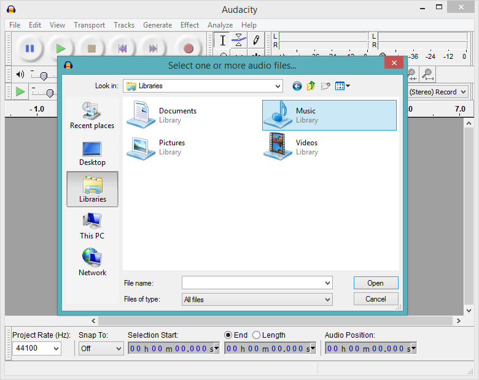

# Audacity
## What is it?
Audacity is free open source software (FOSS) which is used for both editing and recording audio.

## What can it do?
It is packed with features such as:
* Cut and paste audio editing
* Audio Analysis
* Recording from microphone
* Dozens of effects for audio such as "Echo" and "Wahwah"
* Generation of sounds

The startup of the program yields an old yet easy to use interface.

