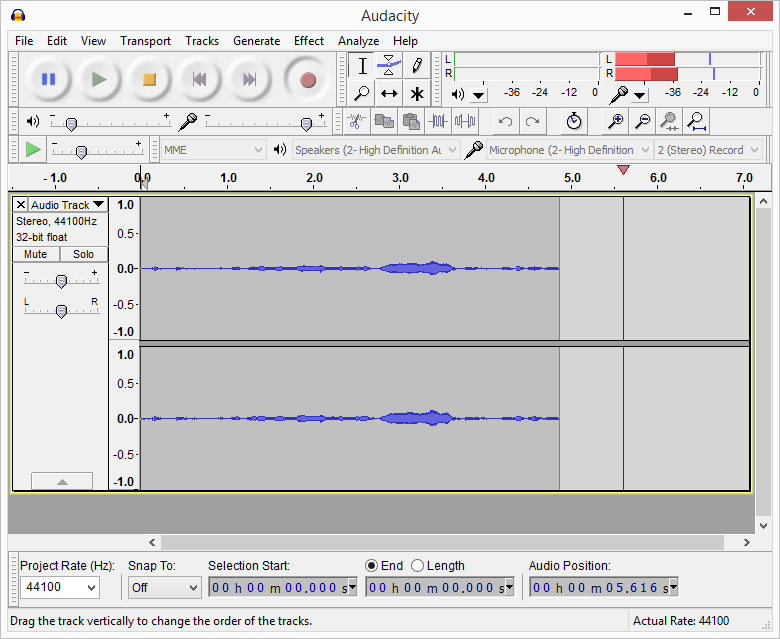

# Audacity
## What is it?
Audacity is free open source software (FOSS) which you can use to edit and record audio.

## What can you do with it?
* Cut and paste audio editing
* Audio Analysis
* Recording from microphone
* Dozens of effects for audio such as "Echo" and "Wahwah"
* Generation of sounds

Audacity has an old yet easy to use interface.

Opening an audio track is easy.

Trophies by Drake in Audacity which can be edited by scrubbing and highlighting and cutting or pasting however you want. 

Recording with Audacity is easy and you can quickly edit the audio.