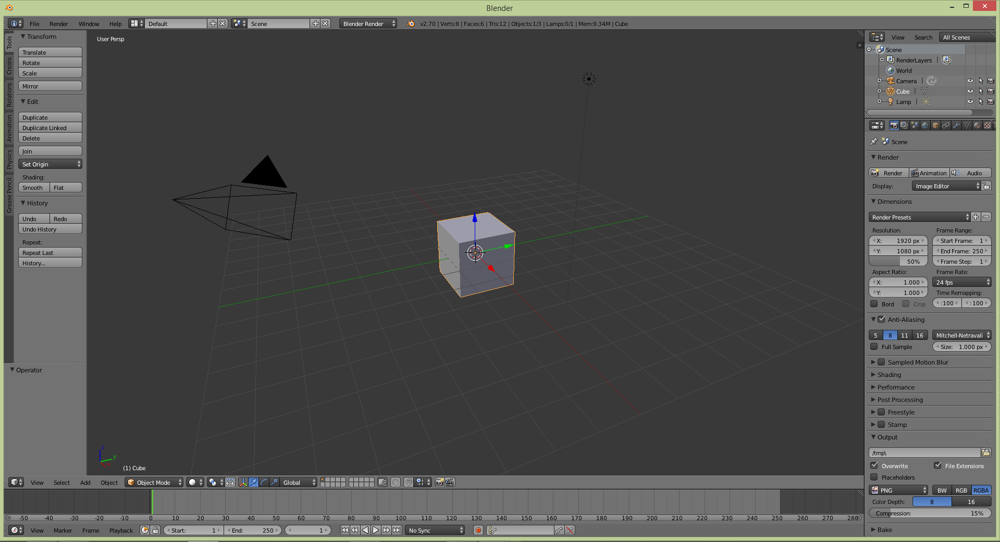
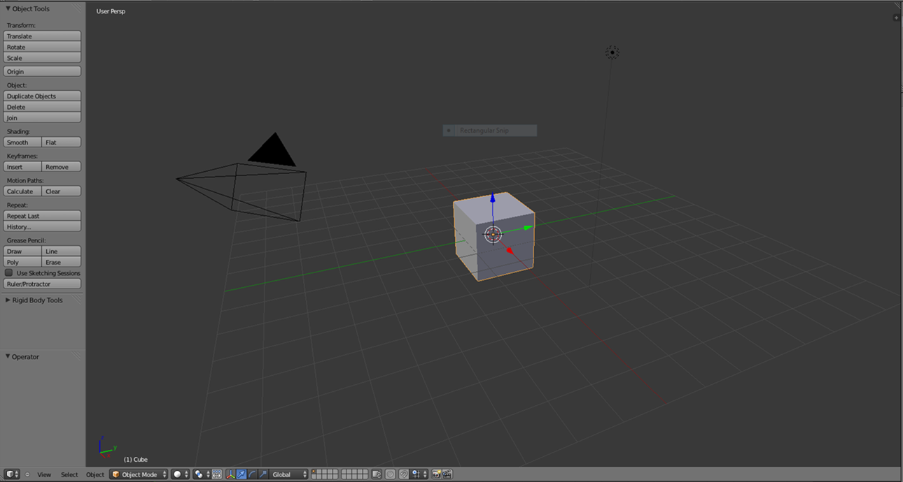
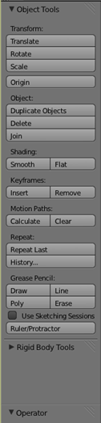
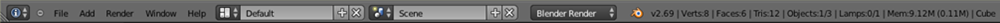
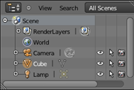
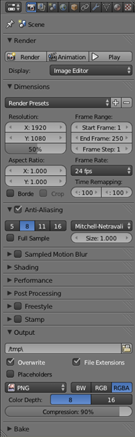
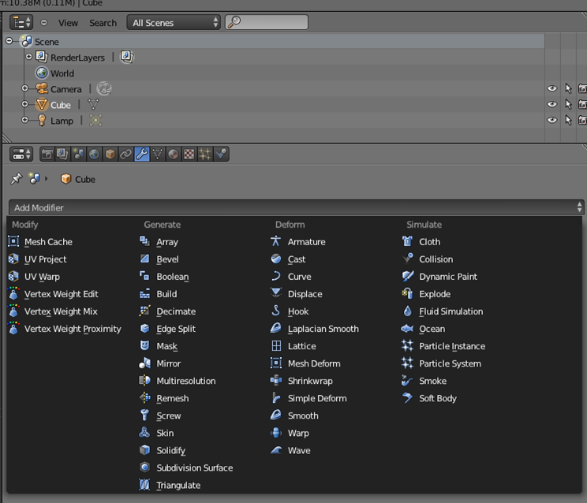

# Introduction to Blender

<h3>What is Blender?</h3>

Taken directly from the site "Blender is a free and open source 3D animation suite. It supports the entirety of the 3D pipeline—modeling, rigging, animation, simulation, rendering, compositing and motion tracking, even video editing and game creation."

<h3>What can Blender do?</h3>
	<ul>
		<li>Create 3D models</li>
		<li>Create armatures and animations</li>
		<li>Render images and animations</li>
		<li>Create simulations</li>
		<li>Game engine</li>
		<li>Image editor</li>
		<li>Video editor</li>
		<li>Text editor</li>
	</ul>

<h3>Why Blender?</h3>

Blender is free!

The Blender user interface seems cluttered because you can configure it to your liking. Figure 2 shows a 3D view in the middle, on the bottom a timeline, and on the right the outliner and properties.

### 3D View

The 3D view provides a view of the model you are using. It also has tools, cameras, lights, and object deformation abilities.

### Tool Bar: In Depth

The tools at your disposal include:

<ul>
	<li>Transform manipulation</li>
	<li>History control aka ctrl z</li>
	<li>Primitive additions</li>
	<li>Relations (Parenting and grouping)</li>
	<li>Animation control with keyframes, motion paths, and baking</li>
	<li>Rigidbody tools for physics</li>
	<li>Grease pencil</li>
	<li>And once you enter object mode, a whole lot of deformation options</li>
</ul>

### Info Bar

The info bar is found in most programs and functions the same as others.

### Animation Timeline

Animation in Blender is fairly easy due to automatic keyframe insertion which will automatically calculate motions in between two positions. 

### The Outline

It is a tree of object currently in the scene you are working in.

### Properties

Many properties can be accessed. Just look at all of the tabs at the top.

### Modifiers

Modifiers can cause awesome things to happen to your model or scene. The best way to learn about how they work is to play around.

### Hotkeys

Hotkeys make life easier, here are important ones
<ul>
    <li>Tab - used for switching to edit mode and back (object needs to be selected)</li>
	<li>Shift S – cursor snap</li>
	<li>Ctrl S – save</li>
	<li>X – delete</li>
	<li>Z – X-ray</li>
	<li>Shift-A – Add an object </li>
	<li>Ctrl-P – Parent an object</li>
	<li>I - Insert keyframe</li>
</ul>
### Further Readings and References
"Blender" - [http://www.blender.org/](http://www.blender.org/)
"Blender Guru" - [http://www.blenderguru.com/](http://www.blenderguru.com/)