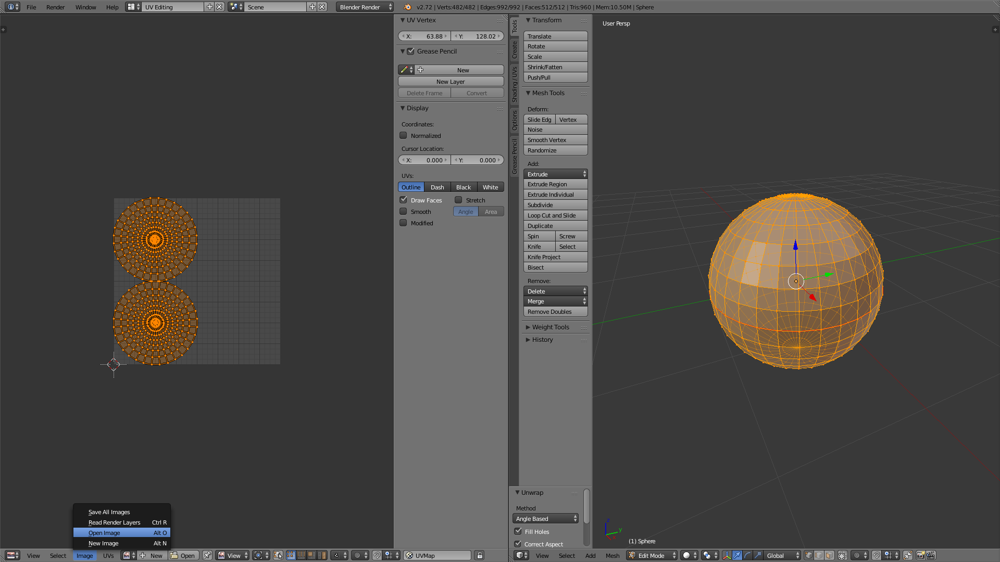
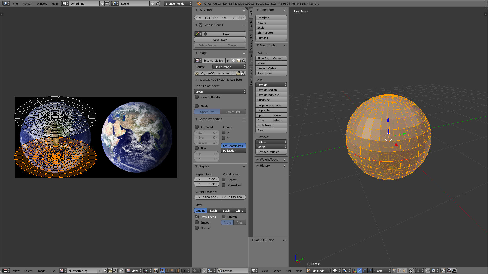
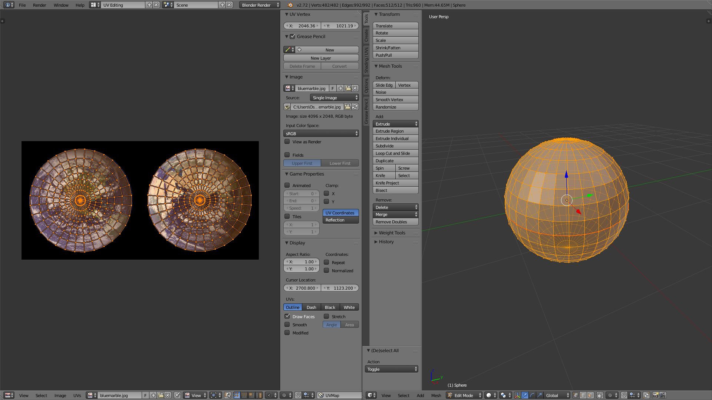

#Blender 3
## UV Mapping
####  What is UV mapping?
It is pretty much creating a map of where your texture will go on a 3D model.
#### Start

Open up Blender, delete the cube and add a sphere

Go into Edit Mode, and deselect everything. Hit Shift-Alt and Right Click the "equator"

Next, hit Ctrl-E and select Mark Seam

Go into the UV Edit Mode

Select all with A then Ctrl-U to Unwrap

Next, download <a href="http://upload.wikimedia.org/wikipedia/commons/1/1c/BlueMarble-2001-2002.jpg">this</a> picture. Open an image by hitting Alt-O, select the image.

After loading in the image, use G to grab the circles and S to scale (you can hit S then X Y or Z to scale on that specific axis). To select 1 circle, hover and press L.

When you are done it should look something like this:

