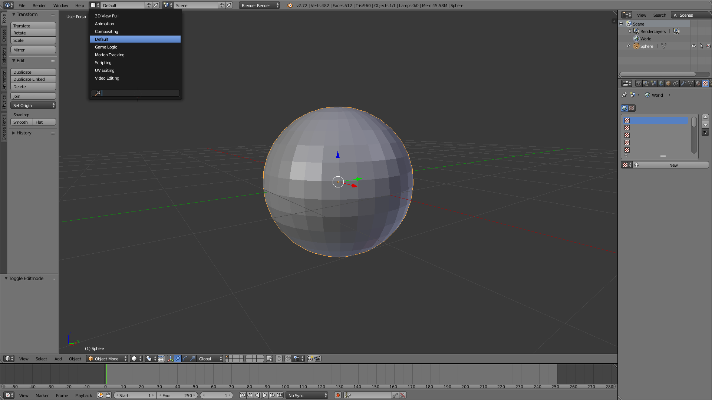
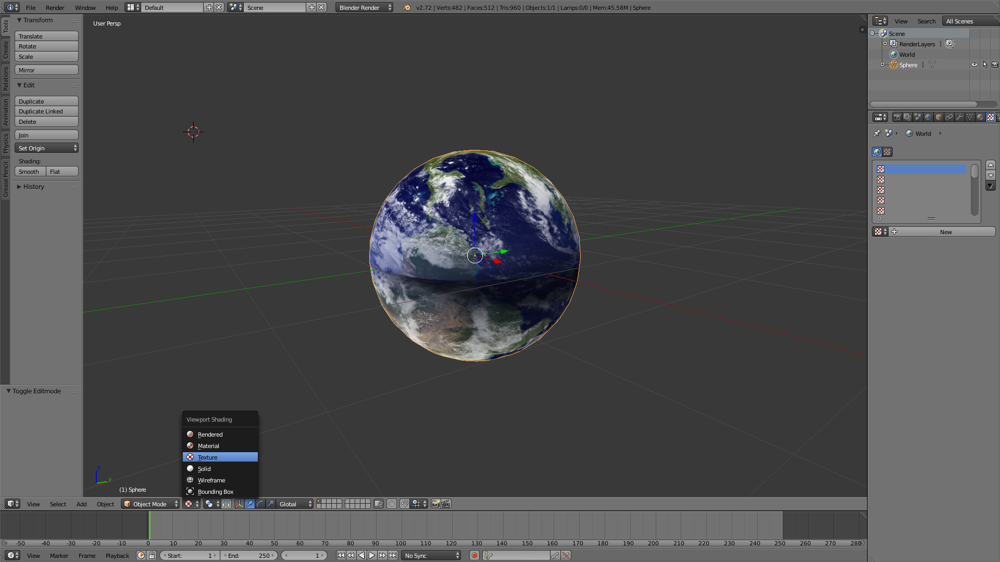
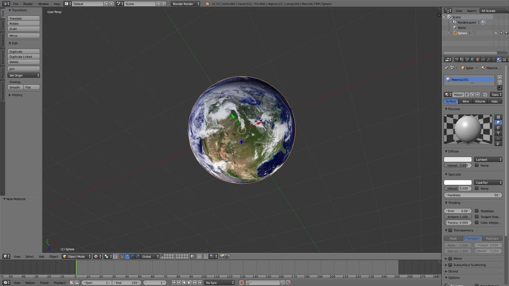
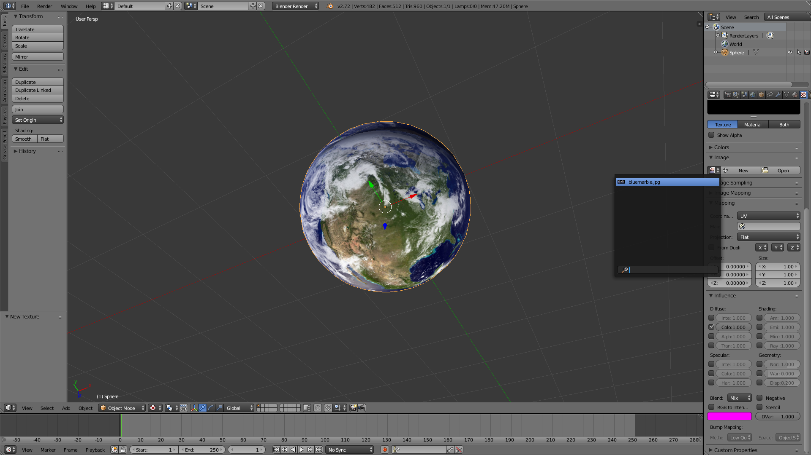
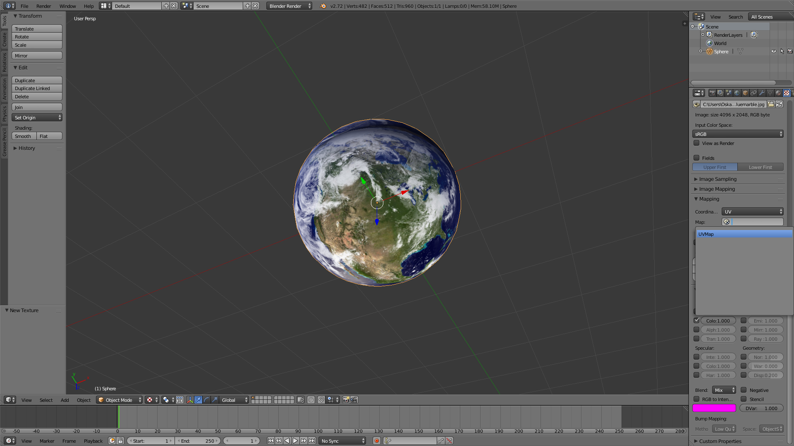
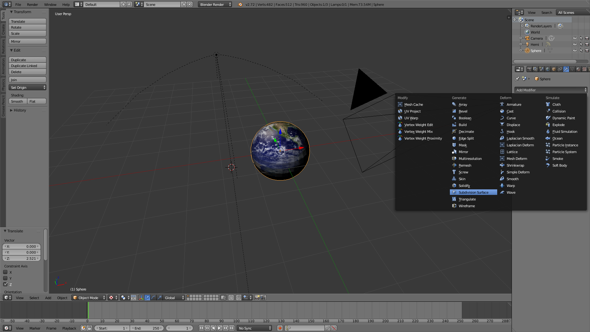
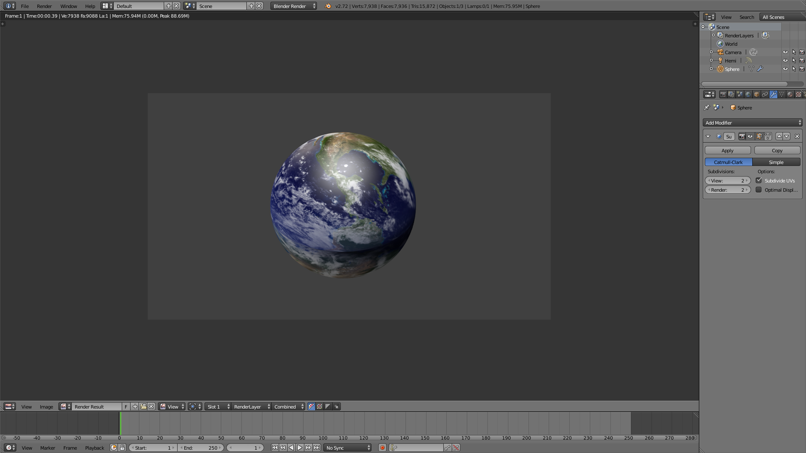

#Blender 3
## UV Mapping
####  What is UV mapping?
It is pretty much creating a map of where your texture will go on a 3D model.
#### Start

Open up Blender, delete the cube and add a sphere

Go into Edit Mode, and deselect everything. Hit Shift-Alt and Right Click the "equator"

Next, hit Ctrl-E and select Mark Seam

Go into the UV Edit Mode

Select all with A then U to Unwrap

Next, download <a href="http://upload.wikimedia.org/wikipedia/commons/1/1c/BlueMarble-2001-2002.jpg">this</a> picture. Open an image by hitting Alt-O, select the image.

After loading in the image, use G to grab the circles and S to scale (you can hit S then X Y or Z to scale on that specific axis). To select 1 circle, hover and press L.

When you are done it should look something like this:

Change into the Default Editing mode

Select the Render Type to shade Textures

Select the Materials tab in the Properties window.

Next, go to the Texture tab and create a new texture. Scroll down and select the Blue Marble image from the dropdown.

In the Mapping Section, select the UV you created

Go to modifiers, add a Subdivision Surface and set views to 2(I modified the camera position and light being used)

Press F12 to render and you have successfully rendered a textured 3D model

