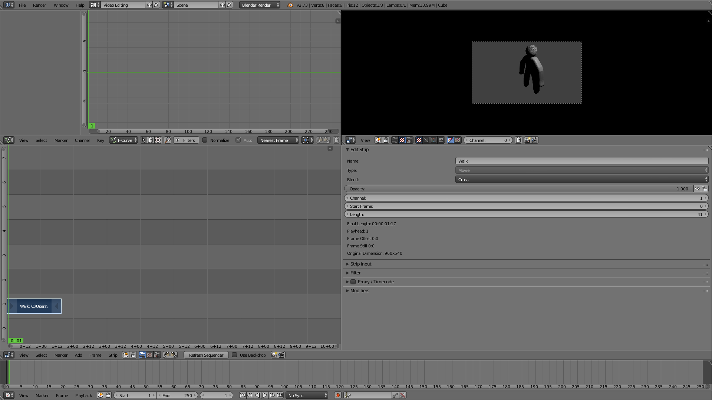
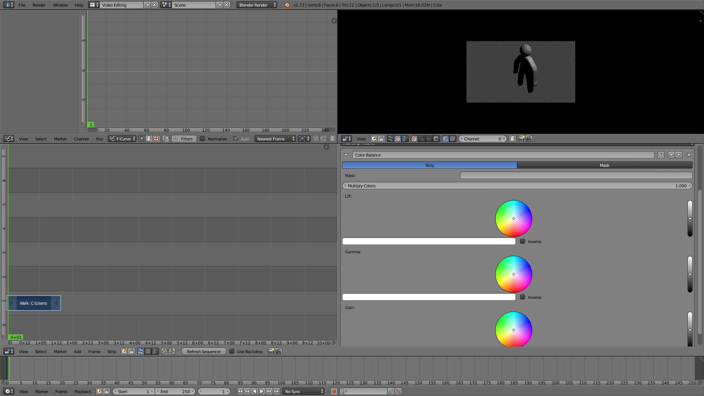

#Blender 4
##Editing Videos in Blender
Blender has a lot of features as it is open source and many people have contributed their own personal projects to Blender. Blender has a fully featured video editor which is useful.
###Importing Videos

Start up Blender and use the Video Editing preset.

Add content, use Add -> [Media Type].

 Use the previously rendered animation of the humanoid.

###Modifying Clips

The properties on the left allow you to edit "strips" in various ways.

The Strip Input allows you to edit the import of the media used.

The Filter adds various filters.

The Proxy/Timecode offers various meta options.

The Modifiers allows for various edits to be made on the strip.

Strips can be duplicated and layered on each other with various blend types. The strips can be cut or shortened or lengthened in numerous ways.

###Exporting Video

Edit the end of the video to match the end of your clips.

Change a window to properties and specify the output for rendering. Hit the animation button and the movie will render.
### Further Readings and References
"Blender" - [http://www.blender.org/](http://www.blender.org/)
"Blender Guru" - [http://www.blenderguru.com/](http://www.blenderguru.com/)