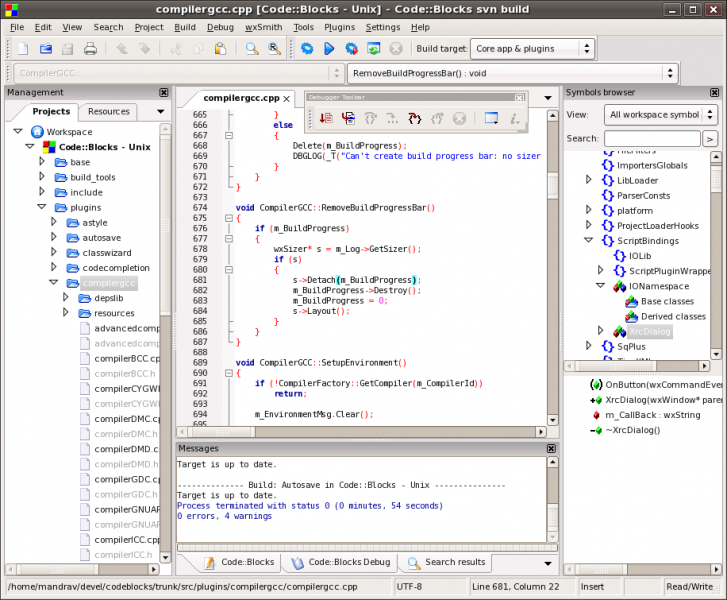
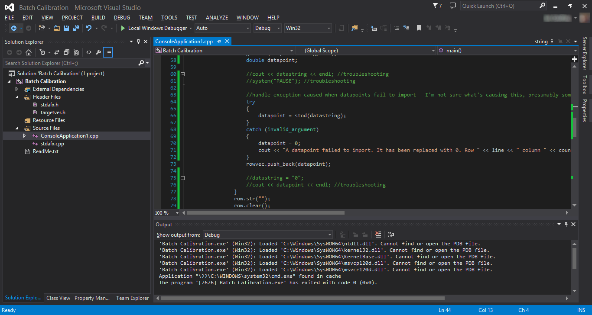
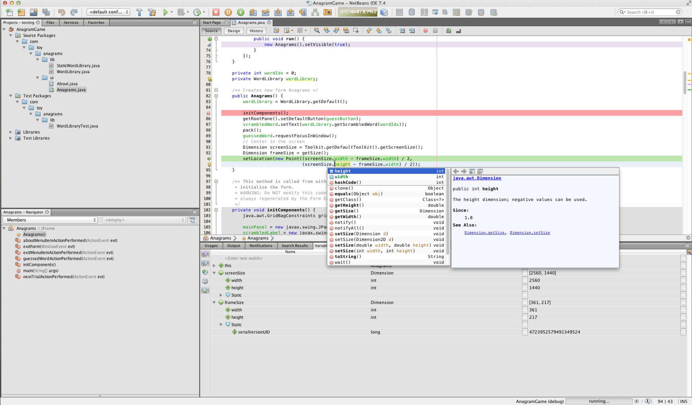
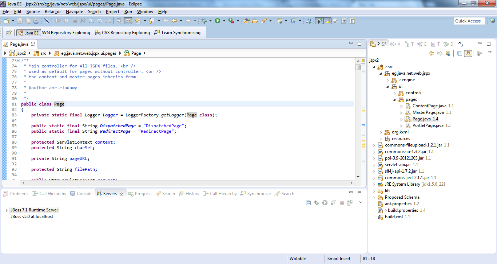
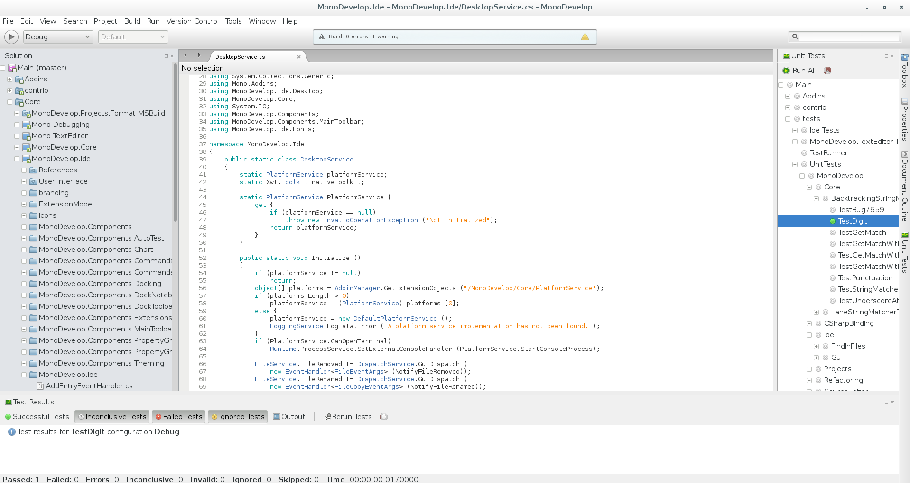

# Integrated Development Environment (IDE)
## What is an IDE?
An IDE is basically a program that allows you to code in a much more efficient way. Usual features include Source Code Editors, Debuggers, and Compilers.
## Which IDE is for me?
### C++
#### Code::Blocks

Code::Blocks is a great IDE for C++. It is free and open source and is a very versatile program. It supports many compilers and is quite customizable.

#### Microsoft Visual Studio

Microsoft Visual Studio (MSVS) is a modern and proprietary IDE by Microsoft. It has a slew of features and is home to many nifty tools. It has a sleek look because it runs the latest .NET framework.

### Java
#### Netbeans

Netbeans is developed by Oracle (they know Java). It can support many languages, but it is famous for Java. It is a perfect beginners IDE as it is easy to use and a complete package.

#### Eclipse

Eclipse is written in Java and although it supports plenty of languages, it was intended to be a Java IDE. Android had a plugin for its SDK, but has since moved to Android Studio. The IDE features plenty of plugins to make life easier.

### C*#*
#### MonoDevelop

MonoDevelop supports many languages, but it is used in Unity3D and Unity3D uses C#. This is a very smart IDE. It is slick and has many smart features such as autocomplete code.

### Python
#### IDLE
IDLE is shipped with Python. It is great for begginersw and is minimalistic. The IDE is not reccomended for advanced users (unless quickly messing around) as it lacks many important features of a functional IDE.
