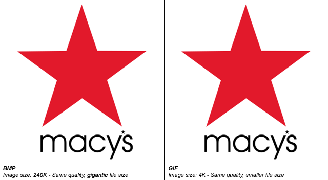
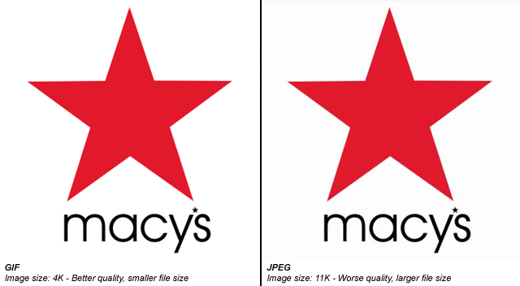
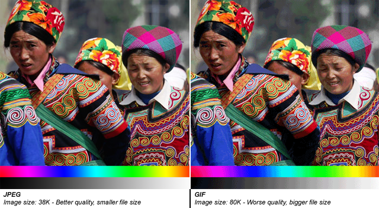
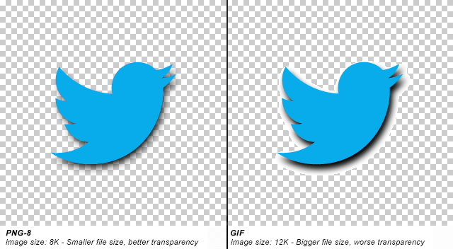

# Image Editing 1
<h2>Image Editing Software</h1>
		
<h3>What is the best software to edit images?</h3>
		
The two most popular image editing software suites are Photoshop and GIMP
 
		
<h3>Photoshop</h3>
		<ul>
			<li>Developed by Adobe</li>
			<li>Costs $10 a month</li>
			<li>Attractive UI</li>
			<li>Relatively low learning curve</li>
			<li>Refined algorithms</li>
		</ul>
		
<h3>GIMP</h3>

<ul>
			<li>Free</li>
			<li>Open Source</li>
			<li>Plenty of add-ons</li>
			<li>Higher learning curve</li>
			<li>Python scripts</li>
		</ul>
		
<h2>Image Types</h1>
		<h3>Bitmap versus GIF</h3>

Both file types are lossless but you will notice that GIF only has a 256 color palette
		
<h3>GIF versus JPEG</h3>

JPEG is a lossy file type so it will lose image data in order to reduce file size. Facebook uses JPEG in order to maximize server space.

		
<h3>JPEG versus GIF</h3>

		

Because of the reduced color palette, GIF appears lossy while in fact it is not.

		
<h3>PNG vs GIF</h3>

An alpha channel is the A component in RGBA data. RGB is red blue green and it determines every color combination possible. RGB is a system in which each value is assigned a number between 0 and 255. The Alpha channel determines the transparency.

		
<h3>What should I use?</h3>
		
Use these concepts to inform your decision. Remember, when in doubt use PNG.

		
<h3>Further Readings and References</h3>
["PNG vs BMP vs GIF vs JPEG" by Chuck](http://stackoverflow.com/questions/2336522/png-vs-gif-vs-jpeg-when-best-to-use)
		