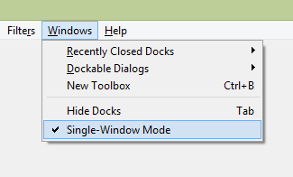
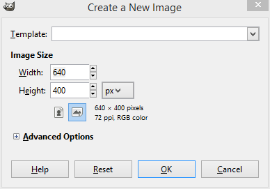
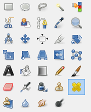
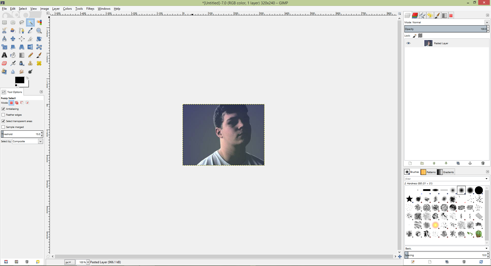
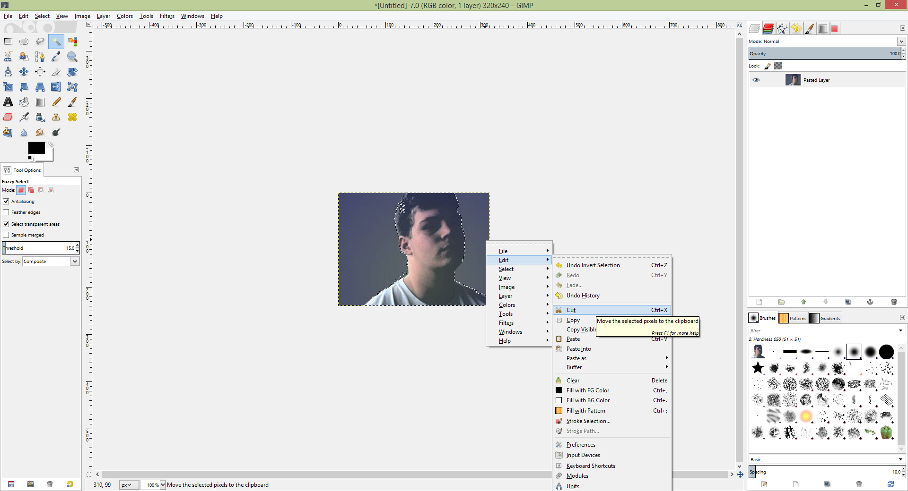
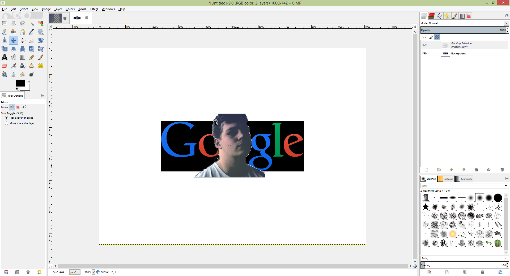

# Image Editing with GIMP
		
### Start
GIMP is talked about in Image Editing 1. The basics will be taught in this tutorial.
		
### Interface

The default interface is not 1 window mode which is more natural. Windows -> Single Window Mode makes the interface more user friendly.

		
<h3>Basic Image</h3>

Create a new image by going to File -> New or Ctrl-N

		
<h3>Tools</h3>

The tools in the toolbox include:

		<ul>
			<li>Rectangle, Ellipse, Free-form Select Tool - Used to select areas</li>
			<li>Magic Wand/Fuzzy Select Tool - Used to select contiguous areas</li>
			<li>Color Select Tool - Select by color</li>
			<li>Intelligent Scissors Tool - Create paths to select shapes</li>
			<li>Foreground Select Tool - Select a region containing foreground objects</li>
			<li>Path Tool - Allows selecting and modifying paths</li>
			<li>Color Pick Tool - Selects the color of any image opened on your screen</li>
			<li>Zoom Tool - Zoom in or out</li>
			<li>Measure Tool - Shows distances and angle</li>
			<li>Move Tool - Moves layers and selections</li>
			<li>Alignment Tool - Align or arrange layers and/or other objects</li>
			<li>Crop Tool - Crops or clips the image</li>
			<li>Rotate Tool - Rotates the active layer, selection or path</li>
			<li>Scale Tool - Scales the active layer, selection or path</li>
			<li>Shear Tool - Shifts part of the image to some direction</li>
			<li>Perspective Tool - Changes the perspective of the active layer, selection or path</li>
			<li>Flip Tool - Flips layers and selections</li>
			<li>Cage Transform Tool - Deform a selection with a cage</li>
			<li>Text Tool - Create text</li>
			<li>Bucket Fill Tool - Fills an area with a color or pattern</li>
			<li>Blend Tool - Fills an area with a gradient</li>
			<li>Pencil Tool - Paints hard-edged lines; that is, the pixels are not anti-aliased</li>
			<li>Paintbrush Tool - Paints soft- or fuzzy-edged lines; that is, the pixels are anti-aliased and/or feathered</li>
			<li>Erase Tool - Erases pixels from a layer</li>
			<li>Airbrush Tool - Paint tool with variable pressure</li>
			<li>Ink Tool - Paints anti-aliased lines with a simulation of a nib</li>
			<li>Clone Tool - Copies pixels from one part of an image to another</li>
			<li>Heal Tool - Heals image irregularities</li>
			<li>Perspective Clone Tool - Clone from an image source after applying perspective transformation</li>
			<li>Blur/Sharpen Tool - Blurs or sharpens an image</li>
			<li>Smudge Tool - Spreads pixels in the direction of a "push"</li>
			<li>Dodge/Burn Tool - Lightens or darkens an image's shadows, mid tones, or highlights</li>
			
</ul>
		
### "Photoshopping" Edges

		
To become a photoshop master, all you have to do is learn how to use the select tools, copy, paste and move.

		
<h3>Further Readings and References</h3>
	["GIMP - Wiki Books"](http://en.wikibooks.org/wiki/GIMP)
	