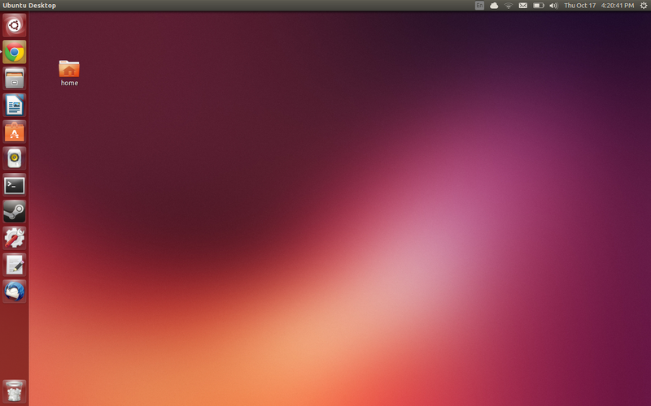
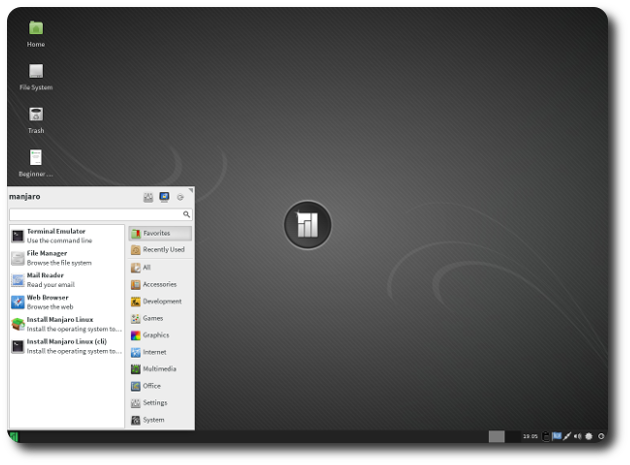
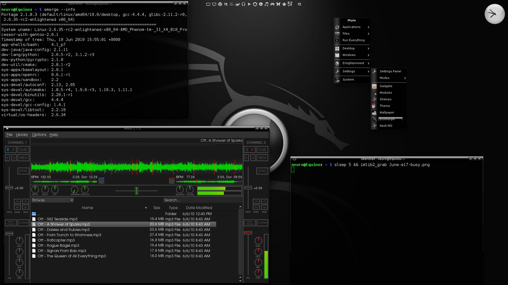

# Linux

### What is Linux?

To make it simple, Linux is an operating system just like Mac OS X or Windows. Linux has many variations called distros. There are over 600 distributions to choose from.

### What are Linux's features?
<ul>
			<li>Open Source</li>
			<li>Free (most distros)</li>
			<li>Excellent stability</li>
			<li>Endless customization</li>
			<li>Small size</li>
			<li>Low system requirements</li>
		</ul>

### Ubuntu
To have an experience that is as easy as Mac OS X choose Ubuntu

Features

		<ul>
			<li>Developed by Canonical</li>
			<li>Stable</li>
			<li>Easy</li>
			<li>The most popular distro</li>
			<li>Going mobile</li>
			<li>Easy UI</li>
		</ul>

<h3>Manjaro</h3>
		
To have an experience that is straight out of the box ready choose Manjaro

		
Features

<ul>
			<li>Based on Arch</li>
			<li>Suite of applications</li>
			<li>Easy</li>
			<li>Fast</li>
			<li>Powerful</li>
		</ul>

<h3>Gentoo</h3>
		
To have an experience that is as hard choose Gentoo

Features

		<ul>
			<li>Super customizable</li>
			<li>Barebones minimum</li>
			<li>Hard</li>
			<li>Advanced</li>
			<li>Fast</li>
		</ul>

<h3>How do I install Linux?</h3>
		<ul>
			<li>Virtually (Virtual Machines)</li>
			<li>Live CD/DVD</li>
			<li>Live USB</li>
		</ul>

<h3>VM</h3>
		
A virtual machine allows you to run an OS inside your own operating system

		<ul>
			<li>1. Download .iso or insert CD/DVD</li>
			<li>2. Run VM wizard</li>
			<li>3. Enter Options and continue</li>
			<li>4. Rest is done for you!</li>
		</ul>

<h3>Live CD/DVD</h3>
		
**CAREFUL**: Partitioning your drive might delete data on your drive

		<ul>
			<li>1. Download .iso</li>
			<li>2. Mount onto DVD/CD</li>
			<li>3. Place in computer</li>
			<li>4. Boot from CD/DVD</li>
			<li>4. Install onto HDD</li>
		</ul>

<h3>Live USB</h3>
		
**CAREFUL**: Partitioning your drive might delete data on your drive

		<ul>
			<li>1. Download .iso</li>
			<li>2. Mount onto USB</li>
			<li>3. Place in computer</li>
			<li>4. Boot from USB</li>
			<li>4. Install onto HDD</li>
		</ul>
