# Intro to World Machine
## FAQ
### What is World Machine?
You can use World Machine to create terrains for video games, videos, or renders.
### How can I use World Machine?
You can use World Machine from start to finish to create your terrain or it can be a middle-man as it has an excellent erosion feature.
### How much does it cost?
The [Basic Edition](http://www.world-machine.com/download.php) is free but limits you to a non-commercial licesnse and a 513x513 terrain size. [Standard Edition](http://www.world-machine.com/download.php?page=buy) starts at $99 and [Professional Edition](http://www.world-machine.com/download.php?page=buy) is $249.
### What should I expect from this software?
High resolution terrain has long render times. Getting you started can be tricky, but most elements are included in this lesson.

## Vernacular 
**Heightmap** - A 2D image that uses shades of black and white to show depth

**Mesh** - A 3D object made up of triangles

## Devices
There are many nodes used on the Device View called Devices. These devices can create, modify, calculate, and export different things and it is highly suggested that you take some time playing around with each.

## Getting Familiar
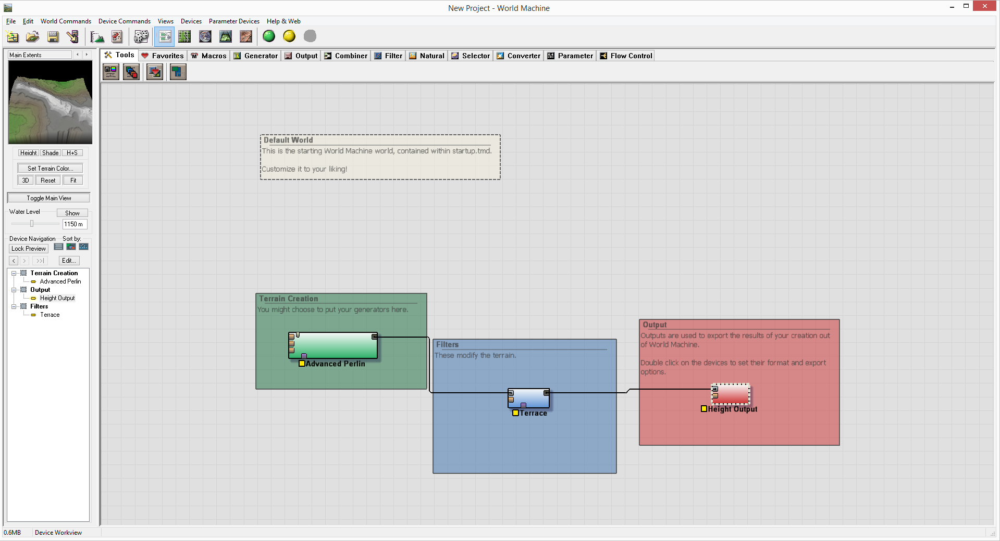
This is what the startup page looks like.

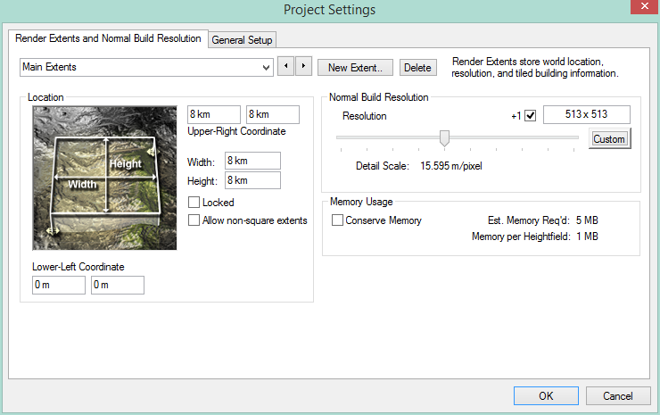
These are world settings which allow you to size your terrain.

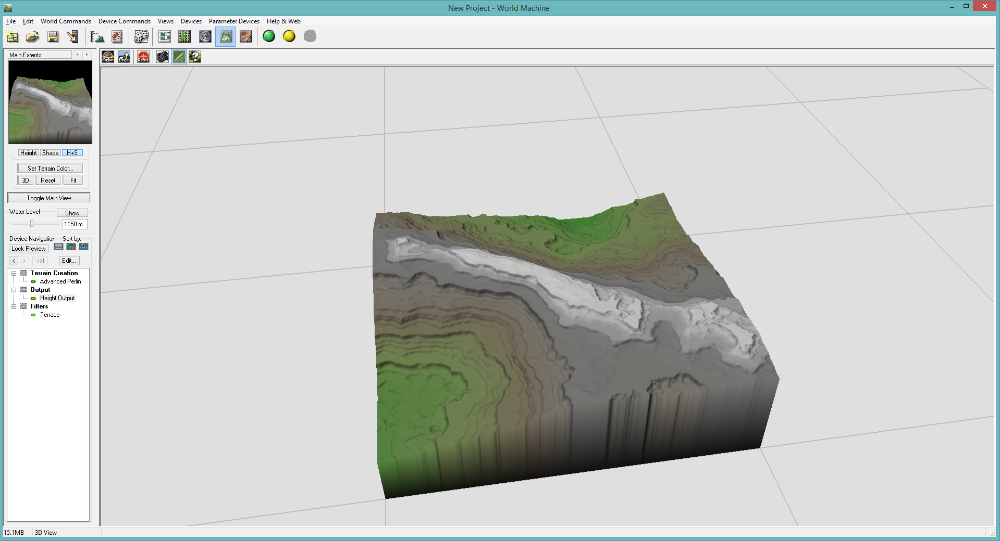
This is the 3D view which allows you to see the terrain mocked up with a texture and colors as well as shading (all of which can be toggled).

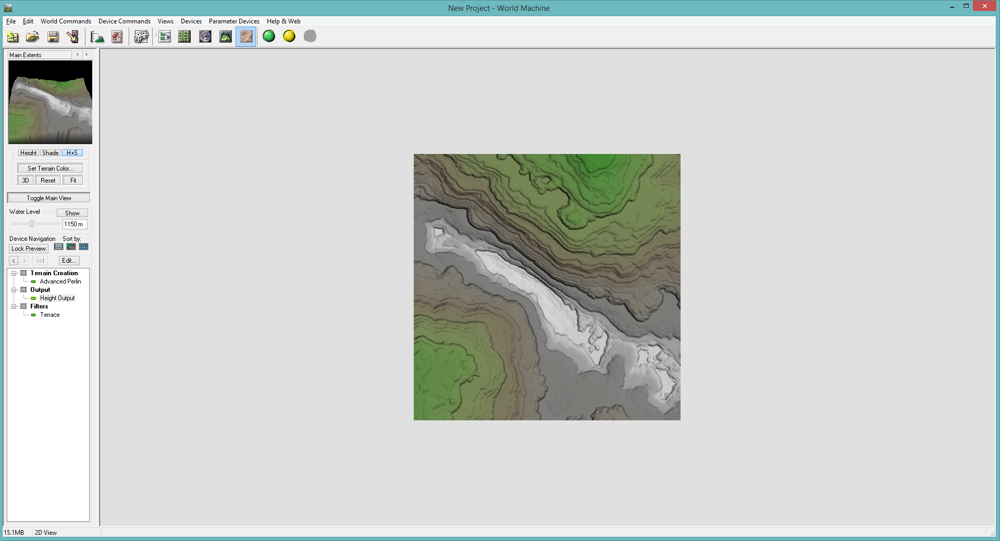
A 2D view (useful for texturing) with heightmap textures and shading.

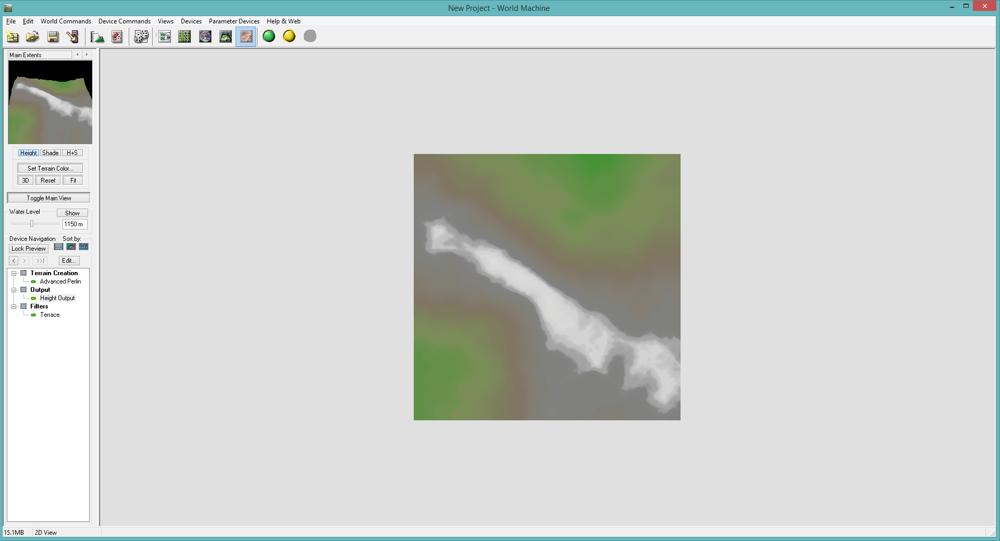
A 2D view (useful for texturing) with heightmap textures only.

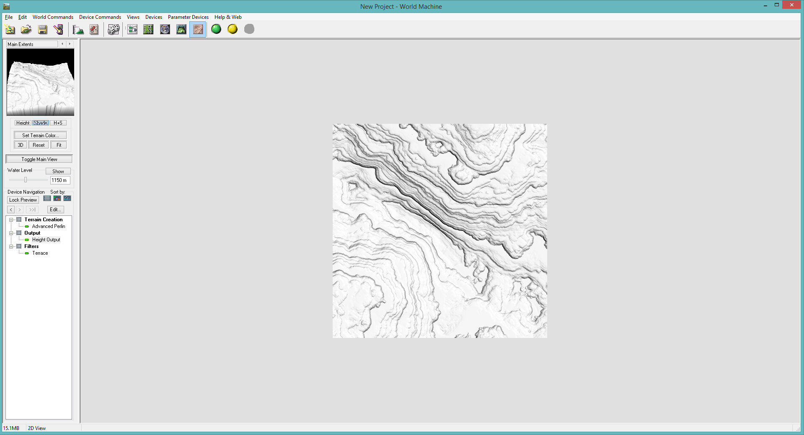
A 2D view (useful for texturing) with shading only.

## Tutorial
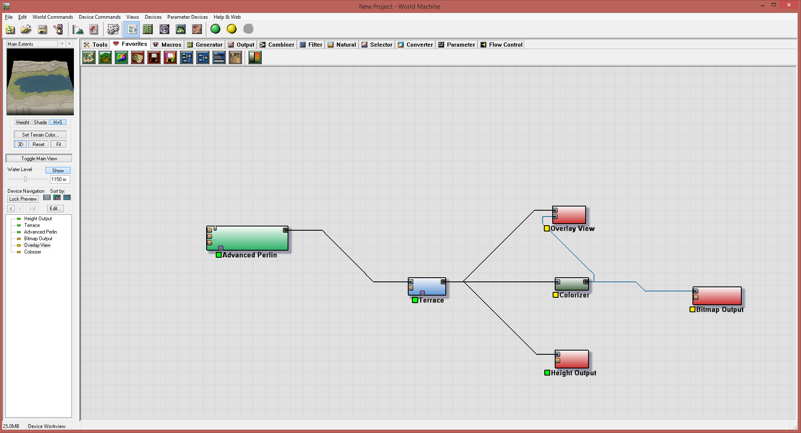
This setup can be used to show a generated texture and a generated mesh on 3D mockup as well as save both the mesh and texture.

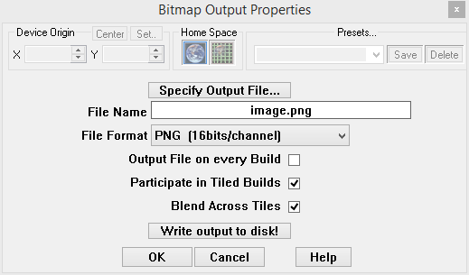
The properties for the output of a bitmap or other image file type.

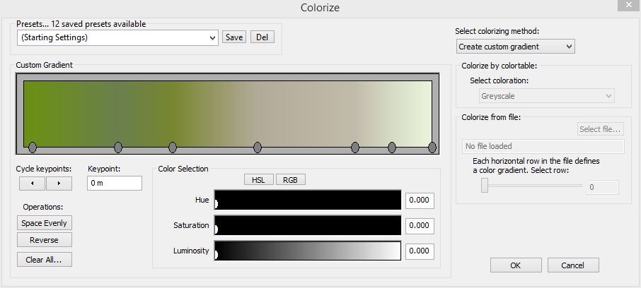
The Colorizer uses gradients to texture a mesh based upon height.

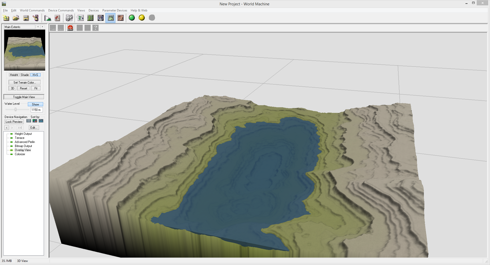
A random (the dice) render which will be used for demonstration purposes.

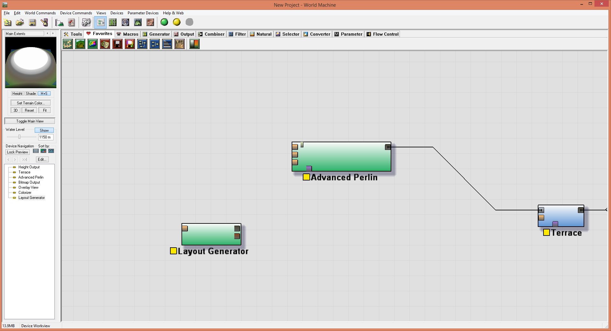
In order to shape our initial Advanced Perlin device, we use a Layout Generator which allows you to build shapes that modify your terrain. You can use it as a shaping guide or as a mask for the layer.

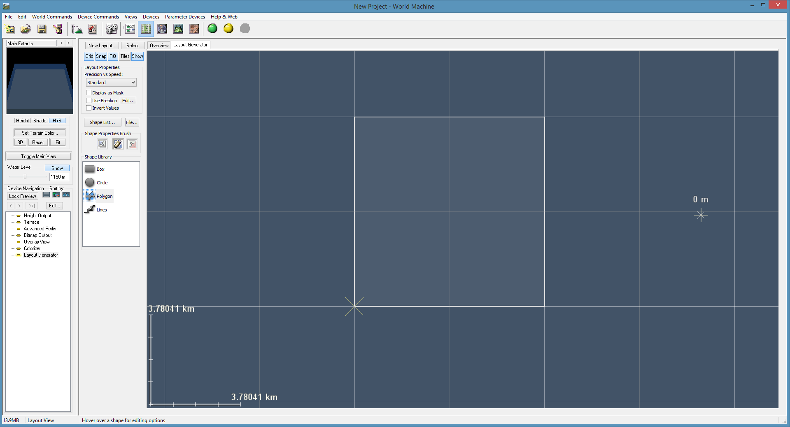
To access the layout tools, double click the device. The screen will change to the layout view. You can select what type of shape you want to create and make sure you do it in the shaded box. 

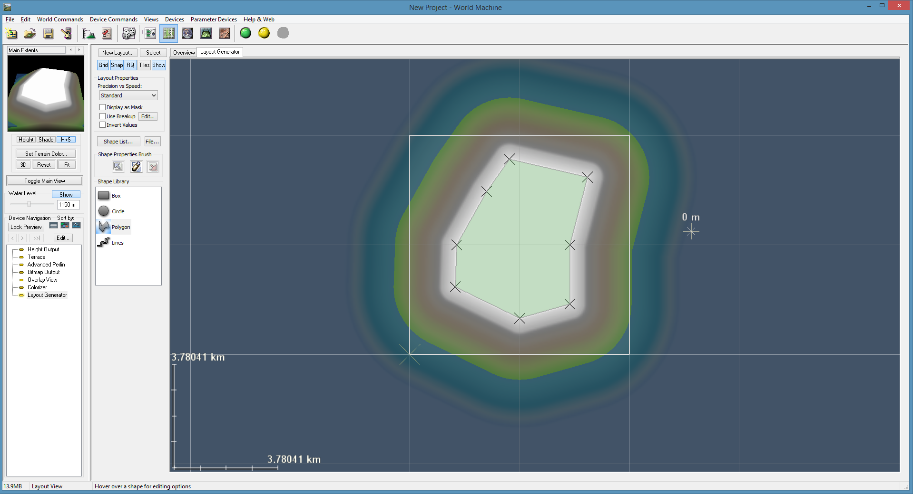
The shape is created and can be edited by double clicking.

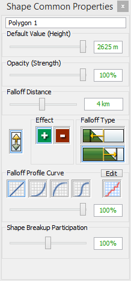

The layout properties can be used to edit the shapes traits. The height affects the height of other devices. The falloff is a gradient that surrounds the shape and the rest is easy not as important, but can lead to interesting terrains. 

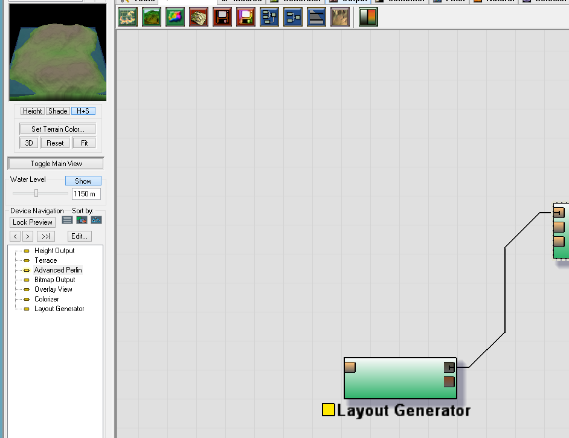
If you connect the Layout Generator to the Shaping Guide on the Perlin Generator, you can see the result.

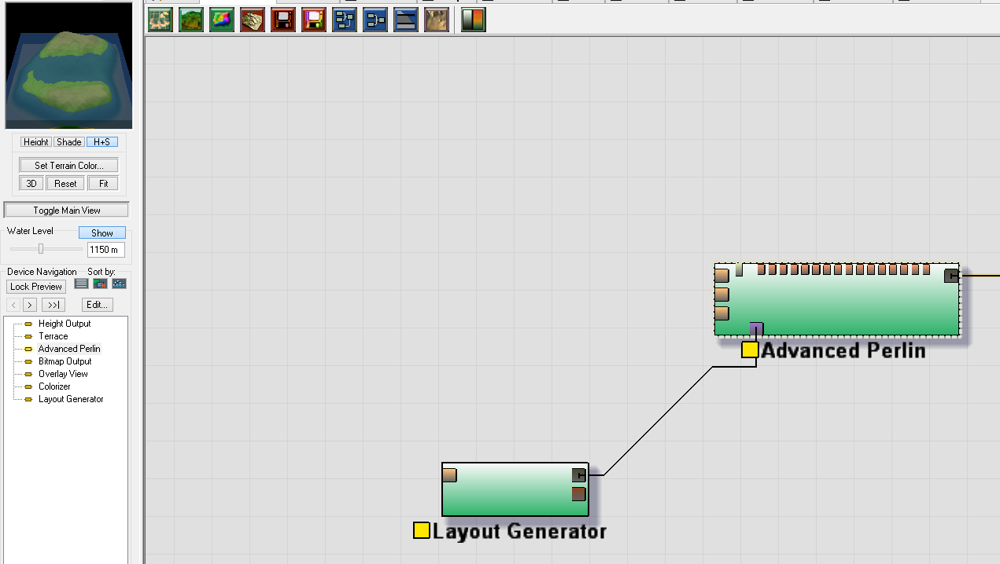
If you connect the Layout Generator to the Mask on the Perlin Generator, you can see the result.

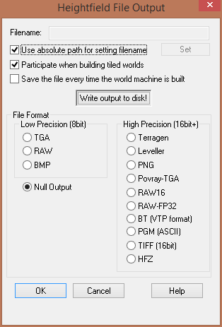

If you are exporting your map to Unity3D or other software, use the height output and the most popular format is usually Raw16 or PGM.

### Further Readings and References

"World Machine" - [http://www.world-machine.com/](http://www.world-machine.com/)