# World Machine 2
## Texturing a terrain
Terrains are easy to make in WM, but to give them a texture is slightly more difficult.

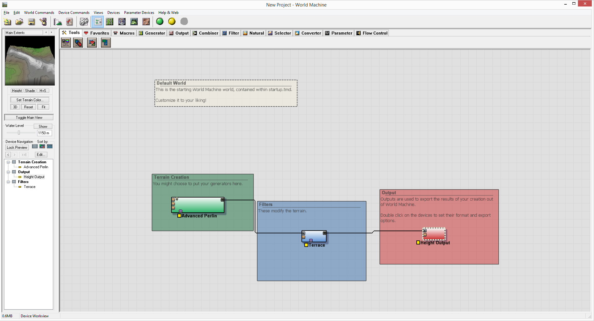

Open up WM and remove the terrace and add Erosion

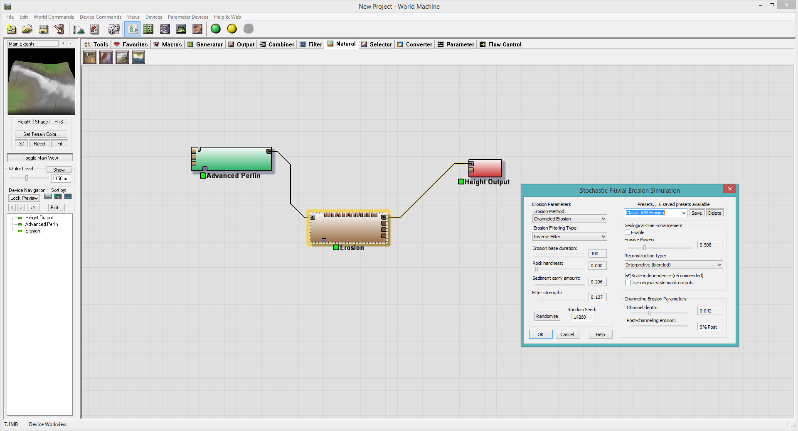
Use the Classic WM Erosion setting for best results

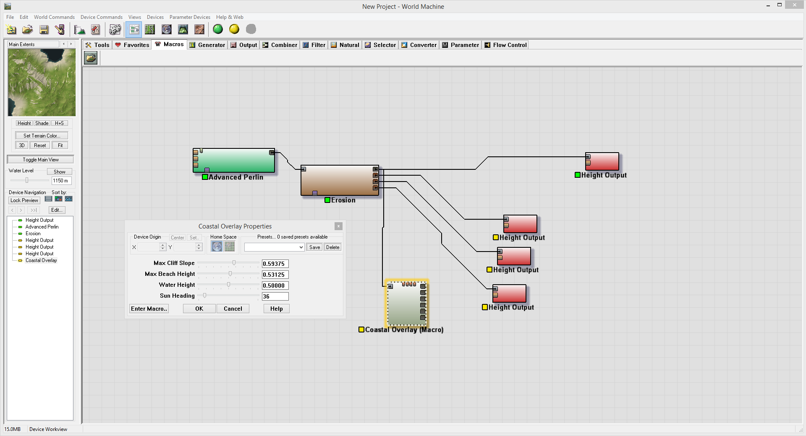
Use the [Coastal Overlay Macro](http://www.world-machine.com/library/index.php?entry=47&focus=1) to create a texure. (Note: [This]( macro has been edited to output many types of maps)

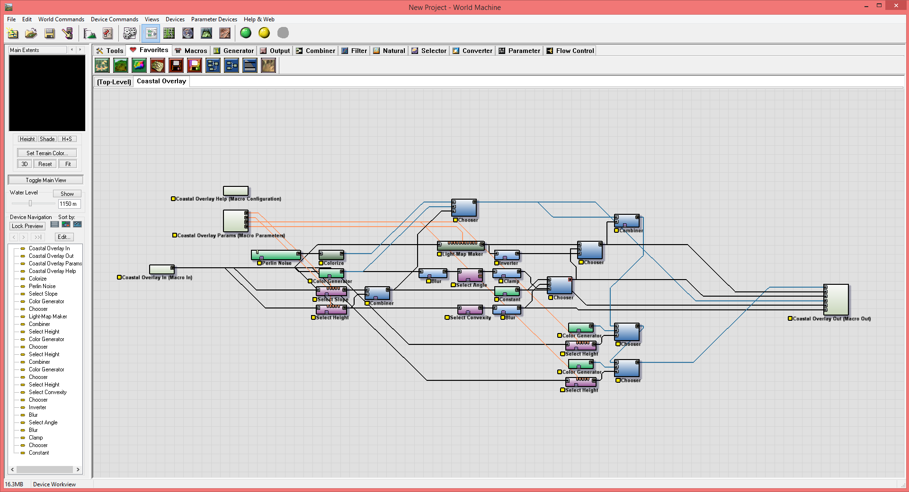
This is what the macro looks like when you enter the macro.

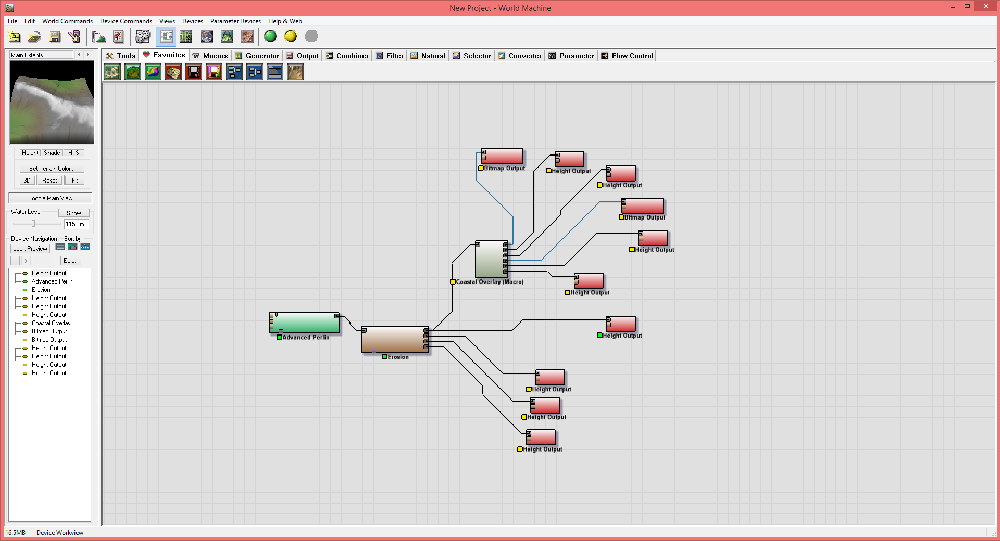

Add Bitmap and Heightmap file outputs. Use PNGs and name according to what it is. (Note: Check off output on every build to quickly create the files by just building)

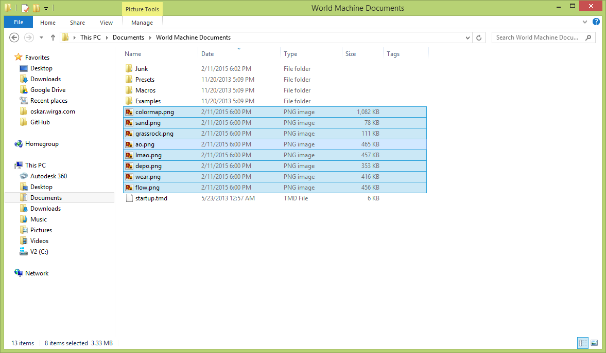

Edit all the output files using GIMP.

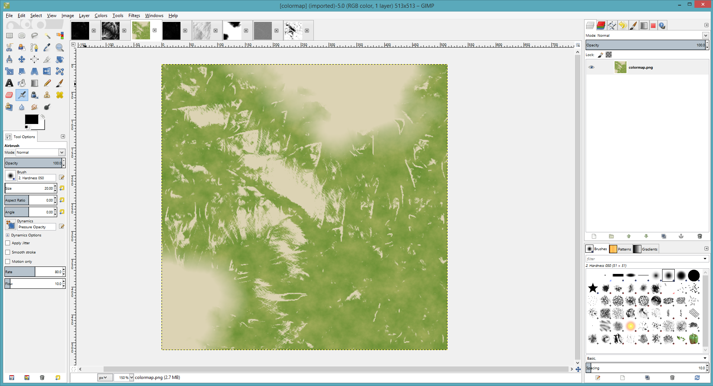

The standard Colormap will be the base texture that will be built upon.

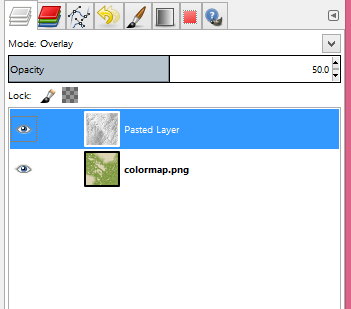
Select the Light Map Ambient Occlusion and paste it as a new layer. Then, select the Mode as Overlay and the Opacity to taste(50% in this case). Continue doing this with the Ambient Occlusion texture and Flow map.

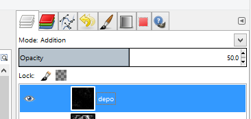

For the deposition and wear map, use Addition and a lower opacity.

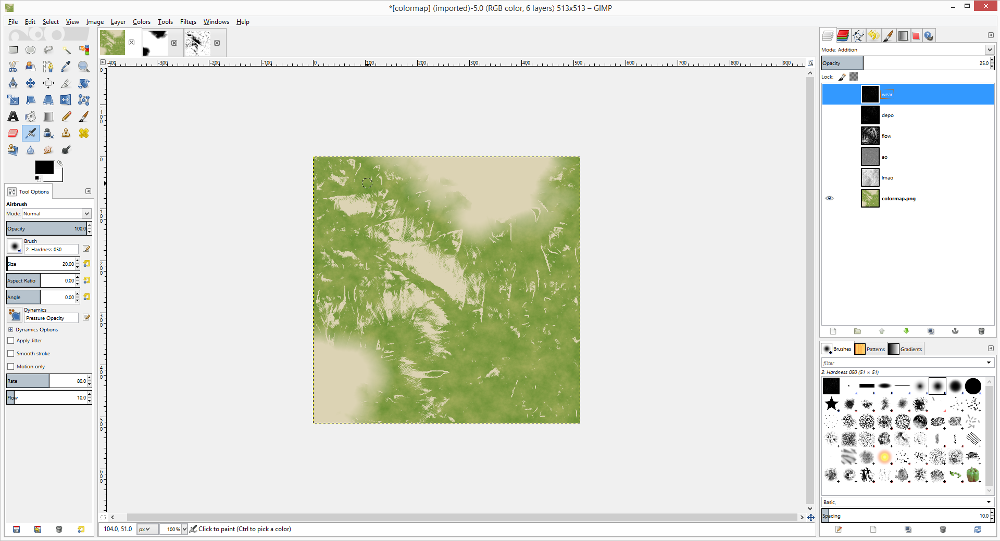

Untouched from the Coastal Overlay

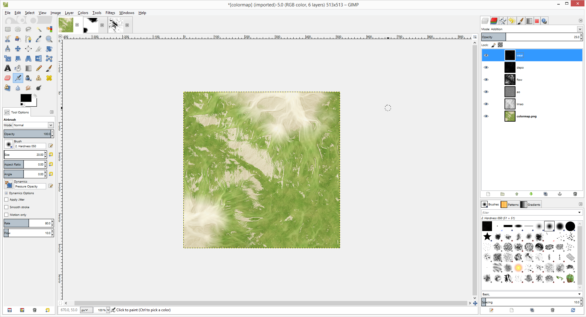

Edited after using GIMP and the generated maps

## Changing colors with Masks

Use the masks from the Coastal Overlay to replace the colors of the Sand, Grass, or Rock.

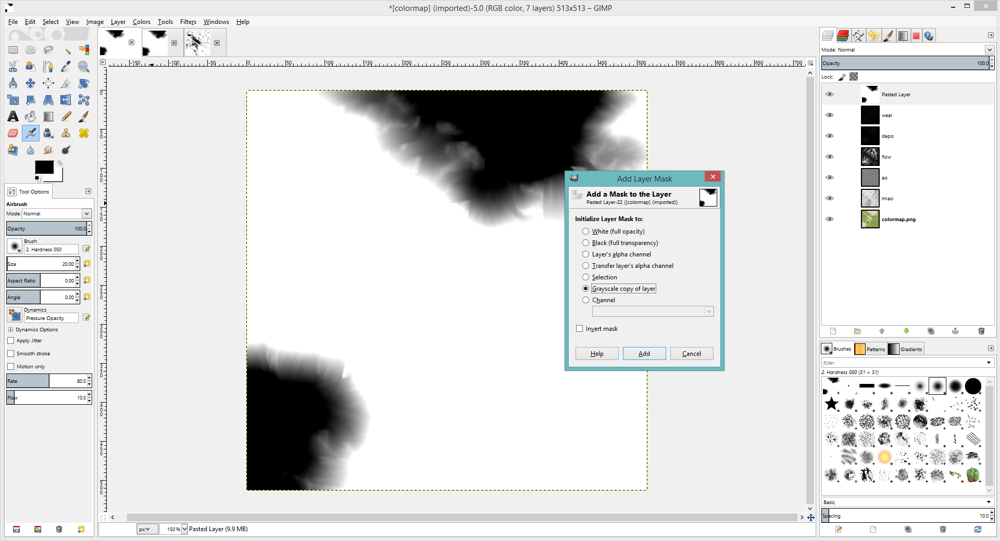
Add the sand mask as a new layer and add a layer mask to it.

